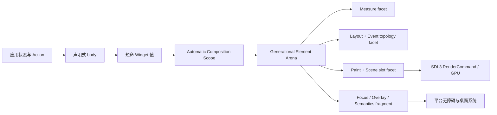
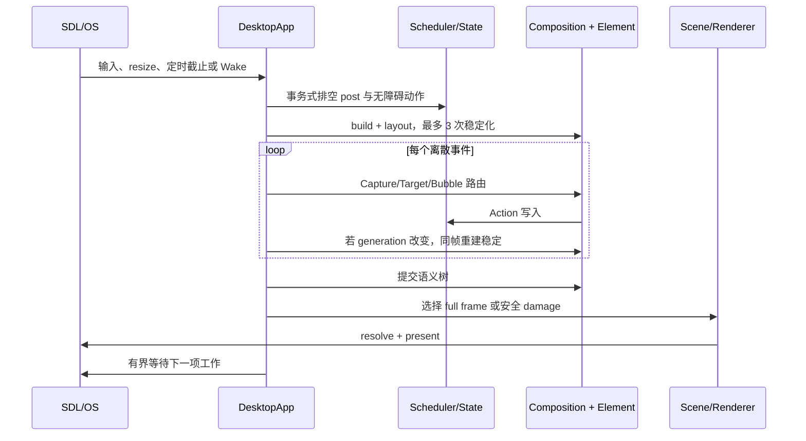

# 从声明式语法到增量 Element 内核：CUI/苍翠 GUI 框架深度解析

> 本文基于 CUI 0.9.5、仓颉 SDK 1.0.5 与提交 `6ebc650` 的源码、测试、示例和性能材料撰写，分析日期为 2026-09-01。文中把“源码已经实现”“当前机器已经验证”和“设计目标”分开表述，避免把 Windows 证据外推到尚未完成实机验收的平台。

如果只看最外层代码，CUI 很像一个仓颉版本的现代声明式 UI：`VStack`、`Button`、`State`、尾随 lambda、链式 modifier，一切都很轻。继续向下读源码，却会发现它并不是“每次变化重新创建一棵控件树，再整窗重画”的简单实现，而是一套相当完整的自动增量 GUI 内核：

- 应用写的是短命、直接的 `Widget` 声明；
- 内核保留的是带代际身份的 `Element`、分阶段依赖、布局提交和场景命令槽；
- 状态写入只唤醒真正读过该状态的作用域或执行阶段；
- 构建、布局、事件拓扑、浮层、焦点和语义树以成功事务为边界一起提交；
- 绘制缓存、局部 damage 和空间索引都必须先证明安全与收益，否则回退到保守路径。

一句话概括它的核心设计：**CUI 用声明式函数 DSL 保持应用代码简单，用保留式增量执行图承担身份、正确性与性能，并且不要求开发者为了优化切换到另一套 UI 编程模型。**

## 一、先看全貌：它到底是什么

CUI 是一个用仓颉实现、底层依赖 SDL3 的桌面 GUI 框架。根包 `src/cui.cj` 统一导出核心布局、控件、文本、媒体、桌面能力和测试 API。当前仓库包含：

- 291 个仓颉源文件，其中 170 个生产文件、121 个测试文件；
- 48 个独立示例目录，覆盖工作台、聊天、日历、表格、编辑器、文件浏览器、排程与设计系统等场景；
- `core`、`controls`、`text`、`media`、`desktop`、`testing` 六个主要子包；
- `VStack`、`HStack`、`Grid`、`FlowRow`、`ScrollView`、`LazyColumn`、`LazyRow`、`LazyList` 等布局；
- 表单、导航、表格、树、日期时间、菜单、浮层、富文本、图像和 Canvas 等常用组件；
- 文件对话框、剪贴板、显示器、系统信息、后台唤醒和 Windows UI Automation 等桌面集成。

项目不是原生控件封装，而是**自渲染 GUI**。窗口、输入和基础绘制由 CangjieSDL/SDL3 提供，控件的布局、绘制、事件、焦点和语义由 CUI 自己掌控。这带来一致外观、统一渲染模型和精细优化空间，也意味着平台原生细节与无障碍桥接需要框架自己补齐。

最小程序保持了很低的进入门槛：

```cangjie
import cui.*

main() {
    let message = State<String>("你好，CUI")
    let app = DesktopApp(WindowSpec("CUI 示例", 640, 420))

    app.run {
        VStack {
            Panel {
                Label(message.value)
            }.flexible(false)
            Button("更新文本", {=> message.value = "状态已更新"})
                .role(ButtonRole.Primary)
                .width(160.vp)
        }.spacing(12.vp).padding(20.vp)
    }
}
```

这段代码已经隐含了框架的四层结构：声明式组合、可观察状态、约束布局和桌面帧循环。下面逐层拆开。

## 二、声明式 DSL 为什么能写得这么自然

仓颉的尾随 lambda、扩展成员和属性语法，让 CUI 不需要代码生成器或专用模板语言就能构造 DSL。以 `src/core/view_builders.cj` 中的 `VStack` 为例，它的构造函数接收 `body: () -> Unit`，执行 body 收集子项，再把自身 `emit` 到外层构建块。

`src/core/ui_build.cj` 中维护了一组仅在 UI 构建线程使用的开放构建块。每个具体 Widget 在构造时调用 `emit(this)`，于是普通仓颉控制流自然就是 UI 控制流：

```cangjie
VStack {
    for (task in tasks) {
        if (task.visible) {
            taskRow(task)
        }
    }
}
```

这里没有 XML 解析、反射式属性表或隐藏的模板编译步骤。构造器调用就是声明，`if` 和 `for` 仍是语言本身的语义。固定结构按声明位置获得身份；条件、循环和重排内容则用 `Keyed`、`ForEach(key:)` 或显式 key 表达业务身份。

链式修饰器也不是一袋最后统一生效的属性。每一步都会包住前一步结果，因此顺序是公开语义：

```cangjie
Label("背景包含留白")
    .padding(16.vp)
    .background(Color.rgb(235, 241, 255), radius: 10.vp)
```

与先 `background` 后 `padding` 的结果不同。可复用 `Modifier` 本质上是 `Widget -> Widget` 的有序变换；`then` 保序且满足结合律，宽运行时集合可用 `Modifier.concat` 平衡重括号，避免超长左结合闭包链。

这层设计的优点很实际：

1. 应用代码保持仓颉原生，可重构、可抽函数、可测试；
2. UI 结构和业务控制流在同一个语法空间，不需要跨语言同步；
3. modifier 的包装顺序、key 的身份含义和资源的生命周期都能由普通类型表达；
4. 框架可以在 DSL 下面替换执行策略，而不改变应用写法。

但“构造器会 `emit`”也意味着自定义 Widget 作者要理解构建上下文；它不像纯值树 API 那样完全显式。CUI 用测试、语义种类和事务式构建来约束这项隐式协议。

## 三、真正的核心：短命 Widget，持久 Element

理解 CUI 最重要的一步，是不要把 `Widget` 和运行时节点混为一谈。

`Widget` 是应用和控件作者看到的协议，定义 `measure`、`layout`、`draw`、`handle` 以及焦点、弹性、事件边界和绘制外溢等能力。Widget 可以在一次声明执行中产生，也可以在下一次构建被新值替换。

真正跨帧保留的是另一组对象：

- `AutomaticCompositionRecord`：保存声明作用域、已提交子项、依赖和局部声明片段；
- `ElementArena`：用 `slot + generation` 管理持久身份，旧代 ID 无法误访问复用槽；
- `AutomaticRenderNode`：代理一个稳定发射位置，持有 measure/layout/paint 依赖；
- `ElementSceneNode`：持有测量、布局、事件拓扑和可重放绘制命令；
- 各类 pending/committed fragment：保存焦点、overlay、semantics 和 frame subscription 的最后成功版本。

可以把两层关系画成这样：



这种分层与 Flutter 的“不可变 Widget + 持久 Element/RenderObject”有亲缘性，但 CUI 把状态读取依赖、失败提交、事件拓扑和场景命令槽更明确地放进同一个 Element 所有权模型。它也不同于传统 retained 控件树：应用并不长期持有可变控件实例，业务事实仍在 `State` 或 Store 中。

### 自动组合如何只重跑脏路径

每个内置 builder body 对应一个自动组合作用域。状态读取会建立 `State -> Scope` 依赖边。状态改变后：

- 直接读取该状态的作用域标记为 `selfDirty`；
- 祖先只标记为 `descendantDirty`，用于到达脏节点；
- 干净兄弟直接采用上次提交结果，不执行自己的 body；
- 父作用域若自己变脏，则保守刷新其自动后代，防止闭包捕获值停留在旧版本。

自动组合宿主测试直接验证了“脏分支重建、干净兄弟只执行一次”。这不是对新旧整棵虚拟树做事后 diff，而是依靠运行时收集到的读依赖事前定位重启前沿。

根作用域还会先把零/一/多子项正规化为一个逻辑根，再缓存正规结果。否则 body 虽然没有重跑，多子项根仍会每帧创建 Stack 并扫描全部孩子，表面命中、复杂度却没有真正降到常数。

### 身份不是字符串越多越安全

CUI 将身份分成两类：

- 固定声明使用“父作用域 + 语义种类 + 同类位置”形成位置身份；
- 动态条件、循环、插入、删除和重排使用显式业务 key。

`remember`、`rememberState`、keyless `mountEffect` 和 `lifecycleEffect` 共用带形状守卫的位置槽。首次成功提交后，槽数量、值类型和声明种类必须保持；形状漂移在修改所有权或启动 effect 前就会失败并回滚。这样既消除了固定结构里到处手写字符串 key 的负担，又不掩盖动态列表真正需要业务身份的事实。

## 四、一帧到底发生了什么

桌面运行时集中在 `DesktopApp`。它不是无条件 60 次/秒重跑 UI，而是一个按需唤醒的事件循环。



几个细节很能体现设计取向：

1. **空闲归零。** 没有输入、状态变化、resize、动画 deadline 或诊断强制帧时，循环进入事件等待；等待上限为 250ms，防止外部阻塞调用长期占用运行时载体。
2. **同一帧先稳定再提交。** build/layout 中若状态又变化，最多做 3 次稳定化 pass；仍不收敛时保留最新完整树，并请求下一帧，而不是无限自旋。
3. **离散事件之间保持一致。** 一批 OS 事件逐个派发；一个事件修改状态后，会在下一个事件路由前重建。于是“鼠标按下打开弹层，紧接着键盘输入”不会继续命中过期树。
4. **后台结果显式回 UI 线程。** `State` 是应用 UI 线程约束的；后台工作通过 `DesktopApp.post` 写入线程安全队列并发出 Wake。
5. **资源确定释放。** `run` 的 `finally` 逆序关闭托管 Resource、无障碍桥、状态存储和窗口，即使构建或控件抛异常也不会跳过清理。

这比“每帧调用一次 render()”复杂，但换来了桌面应用很重要的低空闲功耗、输入一致性和异常资源边界。

## 五、分阶段依赖：让状态变化停在最早必要阶段

现代 GUI 的性能分水岭并不是语法看起来像函数还是对象，而是框架是否知道**谁在什么阶段读了什么状态**。

CUI 为 build、measure、layout、paint 分别收集依赖。`AutomaticRenderNode` 的三个 phase 依赖集合彼此独立：

- build 读取变化：重跑受影响声明作用域，并向后失效必要阶段；
- measure 读取变化：从测量开始，不反向污染 composition；
- layout 读取变化：重做布局和后续绘制，不重跑声明；
- paint 读取变化：只使绘制命令失效。

仓库测试构造了三个独立 `State`，分别只在 measure、layout 和 draw 中读取，并验证 paint 变化不会增加 measure/layout 次数，layout/measure 变化也不会重新执行 build body。

依赖收集本身也经过专门优化。常见窄集合先线性扫描，第 9 个唯一源才提升为哈希索引；稳定阶段按上次已提交的有序读取轨迹做前缀配对，首个差异才进入通用集合协调。也就是说，内核没有为了“理论 O(1)”让每个只有一两个依赖的节点都承担 HashMap 分配。

更重要的是，依赖与最后成功结果同寿命。Widget 被替换时，旧 phase frontier 只变成 stale，不会提前销毁；新阶段成功收集后才原子换边。若 measure/layout 抛异常，旧依赖仍能继续使旧提交失效，不会出现“结果还是旧的，依赖却已经换成一半新的”这种缓存裂缝。

这是 CUI 最有技术含量的优势之一：**增量不仅是少做工作，还要保证失败时仍然回到一个完整、可继续失效的版本。**

## 六、状态系统不是一个简单的可变盒子

CUI 的状态 API 形成了一条由浅入深的架构阶梯：

```text
局部值：State / rememberState
    ↓ 可写字段投影
Binding / Lens
    ↓ 只读派生
DerivedState / selector
    ↓ 大型特征与单向数据流
Reducer / ModelStore / ScopedStore / FeaturePath
    ↓ 外部效果
EffectReducer / Transition / EffectBatch / EffectStore
```

小窗口可以只用一个 `State`，复杂应用才逐层升级；下面的 Element 和帧循环始终是同一套。

### State：有序、可重入、事务式通知

`State<T>` 的观察者按注册顺序运行。一次通知在开始时固定参与窗口：过程中取消的后续观察者会被跳过，新注册的观察者从下一次写入开始；嵌套写入会开启新的逻辑窗口。实现用 tombstone 和最外层压缩保持稳定下标，无需每次复制监听数组。

在 `DesktopApp.batch`、事件派发或 `post` 事务中，同一 State 的多次写入合并为“事务前值 -> 最终值”。显式等价策略还能消去首尾等价的净零事务。若某个观察者抛异常，调度器记录首错，但继续排空其他 State 通知和 Derived continuation，达到不动点后再重抛；业务回调失败不会饿死框架的失效边。

默认 State 把每次赋值视为事件；只有业务确实定义了等价关系时，才使用 `structuralEqualityPolicy` 或自定义策略。`cui.testing` 还提供等价策略的自反、对称、传递反例检查，避免“一个省重建的比较闭包”悄悄破坏状态语义。

### DerivedState：惰性图，而不是同步副本

`DerivedState` 从一个或多个 Observable 计算，不拥有第二份业务事实。它缓存源 revision 与结果，源变化先传播“可能失效”，真正读取时再计算。

内置 State 图还有一个进程级写入 epoch：epoch 没变可以 O(1) 证明所有内置源都没写；epoch 变了只说明“可能变化”，仍会精确比较 revision 向量，不会把无关状态写入误当成结果变化。稳定宽派生在 UI 依赖图中是一等节点，无论它内部连接多少源，当前作用域只保留一条直接边。

结果等价策略可以把“根模型变化”投影为“当前字段是否真的变化”。它只过滤读取侧 revision 和失效，不能吞掉 Action 或 Effect。

### Binding 与 Lens：深字段仍然只有一个事实源

`Binding` 不保存字段副本，而是把根模型的读写投影交给控件。`Lens<S,A>` 进一步把 get/set/update 变成可组合路径，并要求 Get-Put、Put-Get、Put-Put 三条定律。

深层 `Binding.update` 会把末端的 `A -> A` 变换逐层提升成一次根 read-modify-write，而不是每层反复读取、重建前缀。`cui.testing` 提供 Lens 与 Prism 的可执行定律检查；有限样本不是数学证明，却能把隐藏同步错误变成可搜索反例。

### ModelStore 与 EffectStore：复杂度按需升级

`Reducer<Model, Action>` 将 Action 解释为纯模型变换，`ModelStore` 只暴露只读模型、selector 和 dispatch，不允许视图绕过 Action 直接拿根 setter。`dispatchAll` 在一个根快照上按序折叠，成功只提交一个 revision，任何中间 reducer 失败都不写回部分模型。

`ScopedStore` 让子视图只看到局部 Model/Action，但仍共享唯一根事实；普通 scope 和末端 selector 会融合成一个派生节点。`FeaturePath = Lens × Prism` 让 reducer pullback 与 Store scope 使用同一份状态/Action 路径，避免两处闭包指向不同分支。

外部 I/O 用 `EffectReducer` 返回 `Transition<Model, EffectBatch>`。Store 先提交模型，再把仍未解释的效果值交给组合根 handler。框架刻意不内建网络库、线程池、重试、取消或隐式同步反馈；后台结果仍经 `DesktopApp.post` 作为新 Action 返回。这个边界牺牲一点“开箱即用的异步魔法”，换来可测试的纯 reducer 和明确的并发语义。

## 七、布局、虚拟化与 modifier

CUI 采用典型的约束布局：父节点向下传可用 `Size`，子节点向上报告测量结果，再由父节点分配绝对 `Rect`。`VStack/HStack` 处理主轴、交叉轴、间距和 flex；`Grid/FlowRow/ZStack/SplitView` 覆盖网格、换行、叠放和分栏。

尺寸单位分工明确：

- `vp` 跟随显示缩放，适合控件、间距和圆角；
- `fp` 额外考虑字体缩放；
- `px` 表示物理像素，适合贴合像素的细节。

显示或字体环境变化会推进 `UiEnvironmentKey`，相同几何约束下的旧 measure/layout 缓存自动失效，不要求应用清空 key 或 State。

### Lazy 容器不是简单的“只画可见项”

`LazyColumn`、`LazyRow` 和 `LazyList` 只物化视口与 overscan 附近的项目。连续滚动位置是实数，而物化窗口是离散索引区间；只要新需求窗口仍被已物化集合覆盖，滚动只做 layout 平移，不重跑 composition。跨过 overscan 边界时，内部 generation 才触发一次结构重建。

变高行使用 Fenwick 前缀索引：

- 查询某行顶部与按 offset 找行是 `O(log N)`；
- 可见 `k` 行的新测量以稀疏补丁更新；
- 批测量全部成功后才提交，异常不会留下半批高度；
- 结构插入或重排时，已学高度按稳定业务 key 迁移，而不是绑定数组槽位。

控制器同时提供 `scrollToIndex` 和 `scrollToKey`。调用方已知 index 时，固定高度路径可 O(1)、变高路径 O(log N)；只有按 key 首次定位才需要构造反向索引。API 保留信息，而不是把 index 先编码成 key，再让框架扫描回来。

这套设计的价值不只是跑得快，也在于消除应用手工维护 `data + revision + rowHeight cache` 三份事实的负担。

## 八、绘制：ScenePatch、显示列表和保守 damage

CUI 的绘制路径并非把每个 Widget 的 `draw()` 永久当成最终提交。稳定且有收益的子树可以被录制成值语义命令缓冲，再通过持久场景槽重放。

### 层次化场景命令槽

`ElementSceneNode` 拥有稳定 `SceneNodeId` 和一个可替换 `RenderCommandSlot`。父场景保留的是子槽身份；局部变化只替换该槽的不可变 buffer，无需复制所有后代命令。这相当于把场景 patch 边界与 Element 所有权对齐。

### 自动显示列表不是“缓存一切”

`AutomaticRenderNode` 的策略是自适应的：

- 先经过 2 个 warm-up frame；
- 至少 24 条命令或包含场景引用才值得缓存；
- 单候选最多 8 MiB；
- 每应用自动显示列表总预算 32 MiB，按 LRU 淘汰；
- 录制中若发现动态帧请求、不可重放资源或依赖自失效，则不提交缓存；
- 被拒绝或动态旁路的候选用 32～256 帧有界退避重新采样，避免每帧承担探测成本。

因此“稳定昂贵绘制”会自动晋升，“便宜节点”和“每帧动态协议”保持直绘。应用不需要手工决定每个边界是否 rasterize。

### PaintOutset：把阴影和 halo 纳入正确性

局部 damage 最容易在阴影、焦点环和 Canvas 外溢处出错。CUI 用 `PaintOutset` 显式声明布局矩形四边之外的保守绘制域；组合逐边取最大，满足结合、交换和幂等。阴影 modifier 自动推导外溢，自定义辉光可显式声明。

这个值同时服务于滚动裁剪、ScenePatch 相交和 damage 合并，避免三套系统各自猜一个固定余量。

### damage 宁可少用，也不能错用

局部 damage 只在纯状态触发、没有输入/resize/定时帧、没有 overlay、focus、hover、drag、pressed 和 frame subscriber 等风险时启用。多个区域取并集，超过视口面积 70% 直接回退全帧；底层 renderer 若不能保留未损伤内容，也会再回退全帧。

仓库的五样本 Windows 基线显示，真实 96 区域仪表盘中命令重放相对强制全量约快 6%，单区域 damage 在命令重放之上再快约 2.6%。这是有收益，但远不是所有硬件上的数量级提升。项目明确保留这项诚实结论，而没有用微基准替代真实 GPU 结果。

### 为什么仍使用 SDL renderer

项目做过 SDL_GPU/D3D12、MSAA/SSAA 与代表命令流探针。新后端在 isolated clear 或部分原语上有潜力，但没有跨过真实代表场景的收益与 P95 晋升门槛，因此生产路径继续使用较简单、稳定的 SDL renderer。这里的成熟表现不是“用了最新 API”，而是**能否用同场景 A/B 证明多一套后端值得长期维护**。

## 九、文本、媒体与动画：基础能力也遵守同一生命周期

GUI 内核是否完整，不能只看布局和按钮。文本输入、资源缓存和动画往往最容易绕开统一失效协议，CUI 则尽量让它们继续服从 State、帧调度与 Resource 所有权。

### 文本：从 UTF-8 编辑到 IME 锚点

`TextField`、`TextArea` 与 `ComboBox` 接收 `Bindable<String>`，内部 `TextEditState` 负责光标、选择、插入、删除和行间移动，`UndoHistory` 保存撤销/重做快照。文本编辑路径包含 UTF-8 边界校正、单词/行选择和剪贴板快捷键；富文本换行测试还覆盖扩展字素簇、跨 span 英文单词与 CJK 行内断点，避免在组合字符中间切开。

焦点输入控件每帧把最新 caret `Rect` 交给桌面 shell，只有位置变化时才调用系统接口，使输入法候选窗跟随光标。失败被视为平台润色失败，不阻断帧循环。这里体现了一个合理边界：编辑模型和布局必须正确，IME 锚点的单次平台拒绝不应让整个 UI 崩溃。

文本布局缓存按字体、字号、样式、文本与 UI 环境区分。缩放文本度量保存在字体栅格空间，命中后再映回逻辑坐标，避免把横纵缩放的全部组合塞进 cache key；字体或环境 generation 改变时再失效。`TextArea` 按正文、字体环境和换行宽度缓存可视行与行宽，只绘制视口涉及的行；预编辑、命中、光标、选区与滚动共享可视行几何。

这些实现说明 CUI 已经认真处理 Unicode、输入和缓存，但它仍不能替代三平台复杂字体、双向文本和各类 IME 的实机资格验证；这也是后续跨平台验证必须保留的项目。

### 媒体：有界、线程归属明确的纹理缓存

`ImageView`、`CanvasWidget` 和共享纹理缓存构成媒体层。默认图像缓存最多 256 项、估算 128 MiB，并公开 hit、miss、加载失败、淘汰、字节数和 renderer 切换等诊断。

纹理是 renderer-owned 且线程相关的资源，因此每个 UI 线程拥有独立 cache；同一线程切换 renderer 时，旧 wrapper 会先关闭。缺失或损坏图像的 SDL 加载失败也会被缓存，避免每帧重复解码同一个坏路径；显式 `invalidateImage` 与 `clearImageCache` 再推进全局 revision。稳定 `ImageView` 还使用固定数量的原子 fast slot 减少热路径查找。

相比一个进程级无界 HashMap，这套实现稍复杂，却同时解决了显存/内存上限、线程归属、负缓存和可观测性。

### 动画：需要帧时续帧，静止后重新归零

CUI 内建三类时间原语：

- `Spring`：半隐式 Euler 的弹簧阻尼，单步最多 40ms，接近目标后精确 settle；
- `Animator`：固定 duration、easing 与 delay 的补间，支持中途重定向；
- `Pulse`：循环或 autoreverse 的永久时间线，适合 skeleton 和呼吸提示。

活动中的 `animate(ctx, ...)` 会调用 `ctx.requestFrame()`，让按需事件循环继续前进；Spring/Animator settle 后不再请求，窗口重新回到空闲等待。Pulse 永不 settle，因此只有真正可见、持续使用它的界面才会持续出帧。若 draw 内出现动态续帧协议，自动显示列表探测会识别并退避直绘，避免把第一帧动画冻结成缓存。

资源型动画器或订阅若需要稳定身份，可由 `remember` 保存；需要确定清理的对象使用 `mountEffect`/`lifecycleEffect`，而不是依赖短命 Widget 被垃圾回收。这让时间、资源和组合身份继续落在同一个生命周期模型中。

## 十、事件、焦点、浮层和无障碍是一套提交协议

许多 GUI 框架的缓存只考虑像素，CUI 则把“能否点击、焦点在哪、读屏看到什么”视为同一帧版本的一部分。

### Capture / Target / Bubble 与 EventOutcome

`EventListener` 支持 Capture、Target、Bubble 三阶段以及 subtree/global 作用域。`EventOutcome` 将 handled 与 stop 两个独立效果组合为：

- `Continue`
- `Handled`
- `StopPropagation`
- `Consume`

组合是结合、交换、幂等的，避免“返回一个 Bool，到底表示处理了还是停止了”的歧义。

### 有序 AABB 索引，但保留无界兼容

自定义 Widget 默认可以在布局矩形外观察指针，因此不能安全地只按 bounds 剪枝。只有子树声明 `PointerEventScope.LayoutBounds`，并且布局事务证明全部孩子受约束时，容器才建立有序 AABB 树。点命中先裁掉不相交分支，同时仍按后声明在上的层序派发；拖拽、按压等需要捕获语义时回退保守路径。

事件索引的写面在 layout 中构造，读面只在完整布局提交时 O(1) 交换。异常布局不会让输入路由看到半更新空间树。

### Overlay、Portal 与焦点片段

Overlay 按声明顺序与 owner 管理，支持原位替换、嵌套弹层和派发中关闭；owner 到索引的映射消除重复扫描。`Portal` 允许内容在声明位置保有状态和事件身份，却在 overlay 层绘制。焦点声明同样以持久 fragment 组合，稳定布局可直接采用，不重新扫描所有后代 focus id。

### 语义树是视觉树的有损投影

内建控件注册平台无关 `SemanticsNode`，包含 role、label、value、状态、bounds 和 action。完整视觉树会被归一化成只保留可访问节点的语义树，同时预建：

- id 到节点索引；
- 父、前后兄弟、首尾孩子关系；
- 空间命中索引；
- action target 表；
- focus 与结构 revision。

提交产出 `AccessibilityUpdate` 增量变更。原生桥和应用自定义 adapter 各有独立 revision cursor 与熔断边界：一个分支失败只隔离自己，不会停止另一个 adapter 或帧循环。

Windows 后端提供版本化 C ABI 的 UI Automation fragment provider，支持层级导航、焦点、空间命中以及 Invoke/Value/Toggle 等 pattern。**当前完整实机证据只覆盖 Windows UIA；Linux AT-SPI 与 macOS Accessibility 仍属于后续平台资格验证，不应写成已经完成。**

## 十一、测试与性能工程本身也是框架设计

### 同构无窗口宿主

`WidgetTestHost` 复用了桌面应用的自动组合、稳定化、事件路由、语义提交、绘制命令和 damage 决策。测试可以：

- 推进一帧并读取 build/layout/draw 指标；
- 发送鼠标、键盘和焦点事件；
- 切换 Incremental / Full 执行模式；
- 比较真实 Renderer 输出与 damage；
- 导出 retained diagnostics；
- 验证 Lens、Prism 和等价策略定律。

这比只对控件 helper 做单元测试更能发现“缓存命中了，但事件或语义还停在旧版本”的系统性问题。

### 本文复验结果

在本文对应工作树上直接执行：

```text
cjpm build   -> success
cjpm test    -> 865 passed, 0 failed, 0 skipped
```

仓库上一轮 Windows 完成度审计还记录了 48/48 示例包、24/24 代表应用真实窗口 test/snapshot/retained-diff、20/20 桌面生命周期和干净发布包验证。测试数后来从审计时的 853 增至本文实跑的 865，因此这里不把两个时间点混成同一个口径。

### 性能证据如何避免“跑一次就宣布更快”

项目基准套件展示了一套少见地严谨的 GUI 性能流程：

- benchmark 包首次运行前强制 clean，避免 coverage 或旧产物污染；
- Windows 混合 CPU 固定到最高 EfficiencyClass；
- 显示测试先做不记样本的稳态预热；
- A/B 同轮正逆序对消，敏感场景用独立进程中位数；
- 同时记录中位数、MAD、全距、P50/P90/P95/P99 和帧预算超限数；
- 活动基线必须先采集候选，再独立审阅并晋升；
- 环境或样本不可比时返回 inconclusive，而不是硬造 PASS/FAIL。

提交说明中给出的代表性 Windows AC 五样本结果包括：

| 场景 | 增量方案 | 对照 | 改善 |
|---|---:|---:|---:|
| 240 分支局部更新 | 579.04 μs | 强制全重建 977.82 μs | 约 41% |
| 96 绘制节点自动显示列表 | 2.26 μs | 强制直绘 18.33 μs | 约 88% |
| LazyColumn 增量物化 | 211.37 μs | 强制全量 280.85 μs | 约 25% |
| 240 selector 等价过滤 | 942.68 μs | 普通 selector 1610.84 μs | 约 42% |

这些数字证明的是当前机器、当前场景与当前基线，不是跨机器排行榜。更有迁移价值的是确定性计数：脏分支数、绘制访问数、物化次数和依赖边数必须与设计复杂度一致。

## 十二、与主流 GUI 框架的技术路线对比

先给结论：CUI 不是简单地站在“立即模式”或“保留模式”一边。它的应用表面是声明式、短命值，内部则保留执行图、Element、空间索引和场景命令；细粒度来自状态读依赖，而不是来自某一个范式标签。

| 维度 | CUI | Flutter | Jetpack Compose | Qt Quick | Avalonia | Dear ImGui |
|---|---|---|---|---|---|---|
| 应用声明 | 仓颉函数 DSL + Widget 值 | Dart 不可变 Widget | Kotlin Composable 函数 | QML 对象声明 + JS/C++ | XAML/C#/F# 控件与模板 | C++ 每次调用提交 UI |
| 持久核心 | Composition scope + Element arena + Scene slot | Element tree + RenderObject tree | Composition/restart scope + layout node | QQuickItem + scene graph | logical/visual tree + retained scene | 内部交互状态 + draw data/command list |
| 更新定位 | 运行时 State 读追踪，分 build/measure/layout/paint | dirty Element/build 与 RenderObject 失效 | snapshot state 读追踪，分 composition/layout/draw | QML property binding 与对象/scene 更新 | 属性系统使 layout/render 失效，场景 diff | 应用每次重新调用，状态主要在用户代码 |
| 绘制 | SDL3 自渲染、层次命令槽、选择性显示列表 | Layer tree + raster thread，现代 Impeller 后端 | 平台 Compose UI 渲染管线 | RHI scene graph，可用 OpenGL/Vulkan/Metal/D3D | retained scene + Skia/平台 compositor | 输出 vertex buffer 与 command list，后端自由 |
| 应用状态架构 | State/Binding/Derived/Reducer/Store/Effect 全阶梯内建 | 基础状态与丰富生态，应用架构通常另选 | State/remember/derivedStateOf，常配 ViewModel | 属性绑定、model/view、C++/JS | binding/MVVM/Reactive 生态 | 业务状态天然外置，由应用控制 |
| 当前平台成熟度 | Windows 完整验证；macOS/Linux 尚待实机资格验证 | Windows/macOS/Linux 桌面稳定支持 | Android 成熟；其他平台取决于 Compose Multiplatform | 桌面与嵌入式生态成熟 | Windows/macOS/Linux 等多平台成熟 | 多后端、常嵌入现有引擎/工具 |

### 对比 Flutter：最接近的“声明值与运行树分离”

Flutter 官方[架构概览](https://docs.flutter.dev/resources/architectural-overview)明确区分不可变 Widget、持久 Element 和 RenderObject。CUI 与它最相似的地方，是都不把短命声明对象等同于底层运行节点。

差异在于：

- Flutter 的 Widget/Element/RenderObject 分层非常成熟，Impeller、DevTools、插件和多平台发布能力远强于当前 CUI；
- CUI 将 State 的 build/measure/layout/paint 依赖收集、事务回滚和事件/语义 fragment 作为内核一等协议；
- CUI 的应用架构从 Lens 到 EffectStore 内建得更“意见明确”，Flutter 通常从生态选择 Riverpod、Bloc、Redux 等方案；
- Flutter 已正式支持 Windows/macOS/Linux 桌面，见[桌面支持文档](https://docs.flutter.dev/platform-integration/desktop)；CUI 暂不能用 Windows 验证替代另外两平台。

Flutter 当前的 [Impeller](https://docs.flutter.dev/perf/impeller) 以离线 shader、显式缓存、现代图形 API 和多线程为目标。相比之下，CUI 的 SDL renderer 架构面更小、证据更保守，但 GPU 上限和复杂视觉效果生态也更有限。

### 对比 Jetpack Compose：分阶段状态读取最相似

Compose 官方[渲染阶段文档](https://developer.android.com/develop/ui/compose/phases)将状态读取归属到 composition、layout、draw，不同阶段有不同 restart scope。CUI 的“读取相位决定最早重启相位”与这条路线高度一致。

相似点还有 `remember` 的位置身份、函数式声明和 modifier 组合。主要差异是：

- Compose 借助 Kotlin 编译器插件生成可跳过组与稳定性信息；CUI 目前主要依靠运行时 builder、State 读追踪和自动晋升；
- CUI 把 generational Element、ScenePatch、damage 和桌面事件/语义原子提交公开记录得更完整；
- Compose 的 Android 平台集成、Material、工具链和生态成熟得多；
- CUI 不要求应用先理解 composable stability 标注，但运行时隐式 `emit` 和自适应策略也有自己的调试复杂度。

### 对比 Qt Quick：CUI 更轻，Qt 更成熟

Qt Quick 的[场景图](https://doc.qt.io/qt-6/qtquick-visualcanvas-scenegraph.html)是完整 retained scene graph，可跨 OpenGL、Vulkan、Metal 和 Direct3D，能够在专用渲染线程批处理和裁剪。QML [property binding](https://doc.qt.io/qt-6/qml-qtqml-binding.html) 也建立属性依赖。

Qt Quick 的优势是平台、设计工具、控件、国际化、文本、原生接口和无障碍的长期成熟度。CUI 的优势是：

- UI 与业务都在强类型仓颉代码中，不需要 QML/JS/C++ 三个边界；
- 短命声明值降低长期可变控件对象的同步负担；
- State/Reducer/Effect 与增量内核使用一套类型系统；
- 事务失败语义和基准证据更容易沿源码追踪。

如果目标是成熟商业桌面、复杂原生集成和多平台长期支持，Qt 仍明显领先；如果目标是仓颉原生、代码驱动、统一自渲染界面，CUI 的心智模型更紧凑。

### 对比 Avalonia：现代 WPF 路线与函数 DSL 路线

Avalonia 官方[架构文档](https://docs.avaloniaui.net/docs/fundamentals/architecture)描述了 retained-mode renderer、属性失效、Measure/Arrange、局部 scene 重建和 compositor；[视觉树与逻辑树](https://docs.avaloniaui.net/docs/fundamentals/visual-and-logical-trees)分别承担模板/资源和布局/命中/事件。

Avalonia 更适合已有 .NET、XAML、MVVM 和 WPF 经验的团队，模板、样式、数据绑定和 DevTools 也更成熟。CUI 则避免逻辑树、视觉树、模板树和 ViewModel binding 多层对象同时常驻，改用函数声明 + 外部状态 + Element 执行图。代价是 CUI 目前缺少 Avalonia 级别的设计器、生态、平台分层和发布成熟度。

### 对比 Dear ImGui：两者都重视“用户状态是真相”，但目标不同

Dear ImGui 官方说明强调 immediate-mode 是 API 与状态所有权模型，不等于低效的立即渲染，也不必然要求持续刷新；它最终输出 vertex buffer 和 command list，见[项目说明](https://github.com/ocornut/imgui)与[范式解释](https://github.com/ocornut/imgui/wiki/About-the-IMGUI-paradigm)。

CUI 与它共享“业务状态不藏在控件对象里”和“声明顺序就是自然控制流”的优点。但 CUI 面向完整桌面应用，额外承担布局缓存、按需事件循环、文本输入、焦点、菜单、语义树和 UIA；Dear ImGui 更适合嵌入引擎的调试器、编辑器和实时工具，后端控制权更直接，应用通常主动运行帧循环。

### SwiftUI：表面相似，不能凭表面断言内核相同

CUI 的 `State`、`Binding`、值式 View 声明与 SwiftUI 很像。Apple 官方只承诺 SwiftUI 会观察数据变化并更新受影响 View，见[状态管理文档](https://developer.apple.com/documentation/swiftui/managing-user-interface-state)。SwiftUI 的内部协调与渲染细节并未完整公开，因此更稳妥的比较是：两者都强调单一事实和绑定；SwiftUI 拥有 Apple 平台原生集成，CUI 则提供可读源码、可替换跨平台后端和更显式的 phase/transaction 诊断。

## 十三、CUI 最值得肯定的五个优势

### 1. 一套编程模型覆盖小组件到大型应用

局部状态、表单绑定、派生值、单向数据流、特征 scope、持久集合和外部效果形成渐进阶梯。开发者不必为了性能或项目变大，重写成另一套 retained 对象模型。

### 2. 增量粒度覆盖 build、layout、paint 和拓扑

许多框架只优化“组件是否重建”，CUI 继续追踪 measure/layout/paint，并把事件、焦点、overlay、semantics 纳入最后成功提交。这使“像素正确但交互版本错误”的问题有统一解法。

### 3. 失败原子性不是补丁，而是架构主线

候选依赖、身份、effect、几何和拓扑先暂存，成功后提交；失败保留上一版可继续失效的完整前沿。GUI 中最难复现的错误往往出现在异常和重入边界，这项设计比单纯快几个百分点更有长期价值。

### 4. 优化有预算、有退避、有全量参照

显示列表有 32 MiB 总预算，damage 有 70% 面积阈值，动态绘制会旁路，新 GPU 后端必须通过代表场景门槛；`--cui-force-full-retained` 和像素差分保留了语义参照。优化不是不可关闭的信仰。

### 5. 代数定律真正落到了工程接口

Modifier/Reducer/EffectBatch 的结合与单位、EventOutcome 的效果合并、Lens/Prism 的往返律、PaintOutset 的 join，都直接决定组合顺序、批处理、回滚和测试方式。数学在这里不是术语装饰，而是帮助实现可组合且可验证的 API。

## 十四、仍需正视的局限

全面理解一个框架，不能只写优势。

1. **平台验证不对称。** API 和条件编译面向 Windows/macOS/Linux，但当前完整自动测试、真实窗口、性能、UIA 和干净交付证据来自 Windows x86_64。macOS/Linux 的字体、输入法、无障碍、窗口系统和 GPU 仍需各自实机基线。
2. **项目仍处在 0.9.5。** 内核很深，但版本号、单次大规模重构和持续增加的 API 意味着兼容性仍可能变化。
3. **渲染后端上限较保守。** 当前 SDL renderer 路线简单可靠，却没有 Flutter Impeller 或 Qt RHI 那样成熟的现代多后端、shader 和复杂合成生态。
4. **桌面能力仍有空白。** `DesktopApp` 当前拥有单窗口、单次 `run` 生命周期；仓库没有展示通用多窗口协调或原生控件嵌入层。
5. **跨平台无障碍尚未闭环。** 平台无关语义树已经建立，但原生桥完整落地在 Windows UIA；其他平台不能只靠 adapter 接口就算完成。
6. **生态和工具链规模有限。** 与 Qt、Flutter、Compose、Avalonia 相比，第三方控件、设计器、热重载、调试生态和商业部署经验仍少。
7. **复杂度转移到了内核。** 应用 API 很轻，但框架维护者必须理解事务 arena、phase dependency、generational ownership、双缓冲 topology 和缓存退避。这个项目已经不是“容易随手改的控件库”。
8. **质量债务仍然可见。** 完成度审计记录了外部 cjlint/cjfmt 的存量问题；严格增量门禁可以防止新增，却不等于存量已经清零。

## 十五、它适合什么项目

CUI 当前最适合：

- 希望全栈使用仓颉的桌面工具、工作台、仪表盘和管理应用；
- 重视跨平台一致视觉，而不是每个平台的原生控件外观；
- 需要表格、树、懒列表、文本编辑、Canvas 和复杂状态组合；
- 愿意用代码声明 UI，并重视可测试 reducer、明确效果边界和性能诊断；
- 以 Windows 为当前主要交付平台，同时愿意参与后续 macOS/Linux 资格验证。

以下场景目前更适合优先评估成熟框架：

- 必须立即获得三平台实机认证、屏幕阅读器和企业级发布支持；
- 高度依赖原生控件、原生视图混排、多窗口或大型插件市场；
- 团队主要资产在 Qt/QML、.NET/XAML、Flutter/Dart 或 Kotlin/Compose；
- 需要复杂 shader、3D、视频合成或高度定制 GPU 管线。

## 结语：CUI 真正先进的地方，不只是“声明式”

声明式语法已经不是稀缺能力。CUI 更值得关注的，是它试图把声明、状态、增量执行、失败提交、场景命令、事件拓扑和无障碍收敛为一个可验证系统。

它没有要求应用长期持有可变控件对象，也没有停留在“每次重跑整个函数”的朴素立即模式；没有把优化交给开发者逐棵树打 retained 标记，也没有为了追求技术标签贸然维护第二套 GPU 后端。它选择的是一条混合但一致的路线：

> 应用层保持短命、声明式、单一事实；内核层保留身份、依赖、阶段结果与平台投影；所有优化都必须尊重最后成功提交，并能退回全量语义参照。

从工程角度看，这条路线的最大优势不是某个微基准数字，而是**局部变化只影响必要工作，异常不会制造半帧世界，应用规模增长也不必换一套心智模型**。

CUI 已经展示出下一代仓颉桌面 GUI 内核的完整轮廓。它接下来的关键不再是继续堆更多抽象，而是用 Linux/macOS 实机、跨平台无障碍、多窗口、文本与 GPU 场景把现有不变量一项项推过真实交付边界。

## 延伸阅读

以下均为对比框架的互联网官方资料，本文不依赖 CUI 仓库中的其他文档：

- [Flutter architectural overview](https://docs.flutter.dev/resources/architectural-overview)
- [Flutter desktop support](https://docs.flutter.dev/platform-integration/desktop)
- [Flutter Impeller](https://docs.flutter.dev/perf/impeller)
- [Jetpack Compose phases](https://developer.android.com/develop/ui/compose/phases)
- [Jetpack Compose state](https://developer.android.com/develop/ui/compose/state)
- [Qt Quick Scene Graph](https://doc.qt.io/qt-6/qtquick-visualcanvas-scenegraph.html)
- [Qt QML Binding](https://doc.qt.io/qt-6/qml-qtqml-binding.html)
- [Qt Quick Accessibility](https://doc.qt.io/qt-6/accessible-qtquick.html)
- [Avalonia architecture](https://docs.avaloniaui.net/docs/fundamentals/architecture)
- [Avalonia visual and logical trees](https://docs.avaloniaui.net/docs/fundamentals/visual-and-logical-trees)
- [Dear ImGui project overview](https://github.com/ocornut/imgui)
- [About the IMGUI paradigm](https://github.com/ocornut/imgui/wiki/About-the-IMGUI-paradigm)
- [SwiftUI managing user interface state](https://developer.apple.com/documentation/swiftui/managing-user-interface-state)
