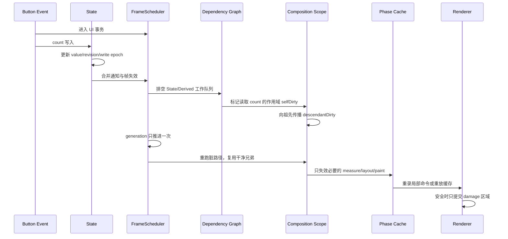
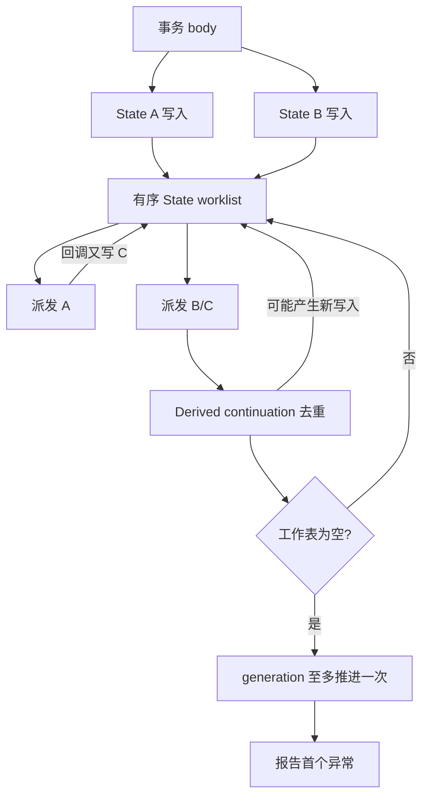

# 一次 State 写入如何只重绘一个区域：CUI 状态管理与增量渲染内核详解

> 本文基于 CUI 0.9.5、仓颉 SDK 1.0.5 与提交 `6ebc650` 的源码、测试和性能材料撰写，分析日期为 2026-09-01。文章可独立发布，不依赖项目内其他文档或图片。当前完整真实窗口与性能证据来自 Windows x86_64；文中不会把这些结果外推成 macOS/Linux 已完成同等级验证。

GUI 框架最容易演示的是“如何画一个按钮”，最难做好的是按钮被点击以后发生的事情：

1. 状态怎样更新，多个写入能否保持一致？
2. 框架怎样知道谁读过这个状态？
3. 为什么只重建一个分支，而不是整棵界面？
4. 重建后如何继续跳过 measure、layout 和 draw？
5. 没有变化时，窗口为什么能真正停下来？
6. 如果构建、观察者或布局抛异常，上一帧是否仍然完整？

CUI/苍翠把这些问题连成了一条统一链路：

```text
State 写入
  → 事务归并与观察者工作队列
  → 依赖边精确失效
  → 自动组合作用域裁剪脏路径
  → measure/layout/paint 分阶段复用
  → Scene 命令槽、显示列表与局部 damage
  → present 后回到有界事件等待
```

这条链路才是 CUI 的核心技术。声明式语法只是入口，真正决定正确性与性能的是状态、依赖、身份、阶段和提交边界如何协作。

## 一、先用一个例子建立直觉

```cangjie
import cui.*

main() {
    let count = State<Int64>(0)
    let app = DesktopApp(WindowSpec("计数器", 480, 300))

    app.run {
        VStack {
            Label("当前值：${count.value}")
            Button("加一", {=> count.value += 1})
        }.spacing(12.vp).padding(20.vp)
    }
}
```

点击按钮后，表面上只是 `count.value += 1`。内核实际完成了下面这些步骤：



如果 Label 所在分支读取了 `count`，它会重建；旁边不读 `count` 的复杂表格可以完全跳过声明体。若某个 State 只在自定义控件的 `draw` 中读取，变化甚至不需要重新 build 或 layout，只需使绘制命令失效。

要做到这一点，状态不能只是“带回调的变量”，缓存也不能只是“记住上次结果”。下面从最底层的 State 开始。

## 二、State 的四个身份：值、版本、依赖 ID、调度器归属

`State<T>` 内部至少同时承担四个角色：

- `storedValue`：当前业务值；
- `stateRevision`：每次被接受写入后的单源版本；
- `identity`：跨泛型擦除仍稳定的依赖源身份；
- `scheduler`：状态进入某个桌面应用后的 UI 线程与失效归属。

读取 `value` 并不是一个完全被动的 getter。它会先检查线程归属，然后把本 State 路由给当前动态读收集器。写入则依次执行：

```text
检查/绑定 UI scheduler
  → 用 mutation policy 判断是否接受
  → 替换 storedValue
  → 推进 stateRevision
  → 推进内置 State 写入 epoch
  → 记录调度器失效
  → 立即通知，或加入事务工作队列
```

依赖 ID 与 revision 分工不同：ID 回答“这是不是同一个源”，revision 回答“这个源自上次采样后是否可能变化”。二者分开，才能复用已有订阅对象，同时精确判断缓存是否仍有效。

### 为什么 State 绑定 UI 线程

桌面 GUI 的布局、焦点、事件与 renderer 资源都存在严格时序。CUI 没有让每个 State 自带锁，也没有允许后台线程直接冲进依赖图，而是采用线程约束：

- State 首次进入应用时绑定当前 `FrameScheduler`；
- 之后的读、写、订阅与取消都必须在该 UI 线程；
- 后台线程通过 `DesktopApp.post` 把普通结果送回 UI 队列；
- post 的 action 在下一次 UI 事务中排空，并用 SDL Wake 唤醒正在等待的窗口。

这不是“框架不支持并发”，而是把并发隔离在业务任务和 UI 提交之间。锁内可以处理网络或文件结果，真正改变 UI 事实的动作仍在一个确定线程、一个确定事务里发生。

## 三、State 通知不是简单遍历回调数组

观察者系统需要回答三个常被忽略的问题：

1. 回调执行到一半取消另一个观察者，后者还运行吗？
2. 回调中注册新观察者，新观察者能看到本次通知吗？
3. 回调中再次写同一个 State，会不会破坏外层遍历？

CUI 的语义是一个**有序通知窗口**。设监听序列为 `L`，通知开始时固定 `n = |L|`，本轮只遍历当时窗口 `L[0,n)` 中仍活动的项：

- 新注册项追加到序列尾部，不进入已经开始的外层窗口；
- 取消尚未运行的项会把它标记为 inactive，因此本轮跳过；
- 嵌套写入会开启一个新的通知窗口，能看到外层回调刚注册的观察者；
- 外层窗口仍按自己的固定上界继续，不被内层扩容扰乱。

实现没有在每次写入前复制监听数组。通知期间的取消只留下 tombstone，`notificationDepth` 回到 0 后才保序压缩。用户回调抛异常时，`finally` 仍会恢复深度并完成必要压缩。

更关键的是异常策略：框架记录第一个异常，却继续向其余活动监听器派发，最后再重抛。否则排在业务插件之后的 UI 失效监听器可能永远收不到通知，屏幕会停在错误版本。

## 四、事务的含义：合并通知和帧，而不是回滚任意 State 写入

`DesktopApp.batch`、一次输入事件和一次 `post` action 都运行在 `FrameScheduler.transaction` 中。

事务里连续写同一个、需要派发事务通知的 State 时，调度器保存：

- 第一次写入前的 `previous`；
- 最终提交时 State 自己持有的 current；
- 是否发生过第二次及后续写入；
- 这个源在当前 pending 队列中的唯一身份。

同一个需要通知的 State 在一个外层事务段中只占一条 pending notification。没有观察者、也没有等价策略的默认 State 不需要创建通知对象，只合并 frame dirty。相邻重复源走最近项快速路径；出现交错写入时才惰性建立 identity 到 notification 的 HashMap。这样常见的单源事务不为通用索引付费。

需要特别区分两种“原子性”：

- `State` 事务保证通知、Derived continuation 和帧 generation 在稳定点合并；
- 它**不保证**用户闭包抛异常时自动把已经写入的任意 State 值回滚。

如果需要“若第 17 个业务动作失败，前 16 个模型变化也不提交”，应使用 `ModelStore.dispatchAll`：先在局部模型变量上完成整个 reducer fold，成功后只写根 State 一次。

这一区分很重要。把观察事务误解为数据库事务，会让应用在异常路径上产生错误期待。

### 为什么 mutation policy 能消除净零事务

默认 State 把每次赋值视为事件。即使事务中 `A → B → A`，revision 仍记录两次被接受写入；存在观察者时最终通知一次，并且这条路径会请求一帧。

显式 `StateMutationPolicy<T>` 改变的是观察等价关系。setter 已证明单次 `A → B` 不等价；只有发生后续写入时，事务提交才需要比较最初 `A` 与最终结果。若策略判定二者等价：

- 不派发 State 观察者；
- 不触发 Derived continuation；
- 不因这条净零路径推进 frame generation；
- 中间 revision 仍保留，作为真实写入历史。

策略必须是便宜、纯且满足自反、对称、传递的等价关系。它不是校验器，也不能在比较中做 I/O。CUI 的测试辅助 API 会对代表样本检查这些定律，并可用诊断 wrapper 统计命中、失败和耗时。

## 五、事务工作队列：先到不动点，再报告首错

事务不只包含 State 通知，还包含 Derived observer 的延迟 continuation。`FrameScheduler` 维护两个有序序列：

- `pendingStateNotifications`：源状态通知；
- `deferredObserverActions`：派生观察者后续动作。

排空协议是：

```text
while 仍有 State 或 Derived 工作:
    先排空当前所有 State 通知
    再执行下一条 Derived continuation
    回调中新产生的写入追加到同一工作表
```

因此多个源先稳定，Derived observer 再读取组合结果，不会先看到“一半新、一半旧”。回调重入产生的新写入不会递归创建另一套 flush，而是进入当前最外层工作表。

异常也不控制工作表前进：

- 第一个异常进入 `first failure` 槽；
- 后续 State、Derived 和回调产生的新写入继续排空；
- 达到不动点后才抛出首错；
- 若 body 与通知都失败，则组合成包含两者的异常；
- 超过 100000 次派发仍不收敛，按观察环错误立即终止。

这项设计解决的是一个非常真实的 GUI 故障：业务观察者抛错以后，框架自己的依赖失效仍必须完成，否则下一帧会错误地认为缓存干净。



## 六、DerivedState：惰性缓存、精确 revision 与 epoch 否定证书

派生值如果只是“源变了就立刻重算”，宽模型会在一次事务里做大量无用工作。CUI 的 `DerivedState<T>` 采用惰性缓存：

1. 创建时固定源集合；
2. 首次读取才计算并缓存；
3. 源失效只传播“可能变了”，不立刻执行 compute；
4. 下次读取比较源 revision；
5. 真正变化才重算并推进 Derived 自身 revision。

### State write epoch 做了什么，没有做什么

完全由内置 State/Binding/Derived 组成的图可以使用一个全局写入 epoch：

- epoch 与上次一致，严格证明所有内置 State 都没有被接受写入，可以 O(1) 返回缓存；
- epoch 改变，只说明某个 State 写过，不能证明当前源变化；
- 此时仍比较本节点的完整源 revision 向量，排除无关写入。

所以 epoch 是**否定证书**，不是全局 dirty 位。它优化“整个进程什么都没写”的常见稳定读取，又不牺牲精确性。自定义 Observable 无法纳入这项证明时，始终走精确 revision 路径。

### 为什么宽 Derived 在 UI 图中只需要一条直接边

一个 remembered/stable Derived 可能依赖 256 个 State。若每个读取它的作用域都展开 256 条边，依赖安装与回收会反复放大。

CUI 将稳定 Derived 视为一等惰性节点：

- UI 作用域只订阅 Derived 自己的一条边；
- Derived 内部持有到全部源的 invalidation-only 连接；
- 源写入只使 Derived 和下游 scope 失效；
- compute 仍等到真正读取时运行。

连接中途失败会逆序关闭已经安装的边。作用域卸载时，整条聚合订阅也会释放。

### distinct 是结果空间的等价过滤

默认 Derived 在任一源 revision 变化后可能推进自身 revision。若根模型频繁变化，视图只关心一个小字段，可以给派生或 selector 提供结果策略。

`DistinctDerivedState` 会先刷新候选结果；若新旧结果在策略下等价，只提交捕获到的源 revision，不推进自身 revision，也不让下游 scope 变脏。

它过滤的是**读取侧传播**，不是写入侧业务：Action 仍执行，根模型仍可提交，Effect 仍交付。把等价策略当成“取消 Action”的工具会破坏单向数据流。

### 从局部 State 到大型应用 Store

CUI 没有强迫所有界面把业务塞进一个全局 Store，而是提供渐进层次：

```text
Observable<T>          只读可观察值
Bindable<T>            可读写值
State<T>               单一可写事实
Binding<T> / Lens      根事实上的可写字段投影
DerivedState<T>        惰性只读派生
ModelStore<M, A>       Action 驱动的只读业务模型
ScopedStore<M, A>      局部 Model/Action 门面
EffectStore<M, A, E>   纯模型归约 + 显式效果描述
```

`Binding` 不是第二份 State。它把字段 getter 与 setter 组合成通向根模型的读写路径；`Binding.update` 会把末端 `A → A` 变换逐层提升，在根 Bindable 上只做一次 read-modify-write。可复用路径由 `Lens` 表达，并要求 Get-Put、Put-Get、Put-Put 三条定律。

`ModelStore` 只把模型暴露为 Observable，视图不能取得根 setter。Action 经过纯 Reducer 产生下一模型，selector 直接复用 DerivedState；显式结果等价策略可以阻止无关根 Action 把某个字段视图标脏。`ScopedStore` 继续把根投影和末端 selector 融合到一个派生节点，直到遇到显式等价边界。

需要文件、网络或计时器时，`EffectReducer` 返回“下一模型 + 有序 EffectBatch”，`EffectStore` 先提交模型，再把效果值交给组合根解释器。线程池、取消、重试和结果 Action 仍由应用决定，不藏在 State 通知链中。

还要区分两个名称相近的类型：框架内部 `StateStore` 保存 `rememberState`、Element ownership 和构建事务；应用级 `ModelStore` 保存业务模型与 Action 规则。前者是 UI 内核的身份存储，后者是可选的应用架构工具。

## 七、读依赖是怎样被收集的

State getter 会查看当前 `FrameScheduler` 的动态 collector。Collector 是一个封闭和类型，大体可以理解为：

```text
None
| Build(StateMountBuild)
| Phase(PhaseStateDependencies)
| Derived(...)
```

不同代码段进入不同动态作用域：

- 执行 builder body 时挂载 Build collector；
- measure/layout/draw 时挂载对应 Phase collector；
- Derived 内部读取时先登记 Derived 本身，再阻止源被重复泄漏为同层依赖；
- 嵌套 collector 用父栈保存并在 `finally` 中恢复。

这使同一个 `state.value` 语法能够根据“在哪里读”自动产生不同失效语义。

### 依赖集合为何不用统一 HashSet

绝大多数 UI 作用域只读 0～2 个状态。如果每次构建都创建 HashSet，理论复杂度漂亮，实际分配和哈希成本却更高。

CUI 对 build 和 phase frontier 都采用自适应表示：

- 0～8 个唯一依赖直接扫描有序数组；
- 第 9 个才提升为 HashSet/HashMap；
- 宽度降回 8 时可以回到线性 committed 表示；
- 稳定读取先按上次有序 trace 做前缀 zip；
- 首个 identity 不一致后，才单调切换到通用集合协调。

稳定声明体通常以同一顺序读取同一组 State，因此前缀证书能复用原订阅对象，不创建临时索引。插入、删除、重排和重复读取仍会正确落入通用路径。

### 依赖提交也是事务

一次 phase 收集有 committed 与 pending 两面：

```text
beginCollection
  → pending 记录本次读取
  → 成功：关闭被删除的旧边，原子替换 committed frontier
  → 失败：只关闭本次新建边，保留旧 committed frontier
```

如果 State 在当前 measure/layout/paint 执行过程中自写，collector 会记录 `invalidatedDuringCollection`。本次结果不能被标成 Current，否则刚算出的值已经基于过期前提；框架返回本次直接结果供当前调用继续，却不会发布成未来可命中的缓存。

## 八、从依赖失效到脏路径：selfDirty 与 descendantDirty

每个自动组合作用域都有持久 `StateMountScope`，保存：

- 父作用域；
- Element ID 与深度；
- committed ownership；
- build dependency frontier；
- `buildDirty`、`buildSelfDirty`、`buildDescendantDirty`；
- `dirtyVersion` 与诊断原因。

某个 Build 依赖变化时，`markBuildDirty()` 从源 scope 向根传播：

- 源节点设置 `selfDirty = true`；
- 祖先设置 `descendantDirty = true`；
- 每层推进 dirtyVersion；
- 同时向最近的 automatic damage sink 报告旧绘制区域。

为什么要区分 self 与 descendant？

```cangjie
VStack {
    let captured = state.value
    Panel { Label("${captured}") }
    HugeStableTable()
}
```

如果 `VStack` 自己读了 State，它的局部变量 `captured` 影响后代闭包，重跑父 body 时必须保守刷新自动后代。若只有 `Panel` 内部读 State，父节点只需进入到这条脏路径，`HugeStableTable` 的 body 可以直接复用。

因此：

- `selfDirty` 表示本作用域的捕获环境可能改变，需要刷新后代；
- `descendantDirty` 表示本作用域只是通往脏后代的壳，干净兄弟仍可跳过。

这比只有一个 dirty Bool 更精确，也避免为了计算“最小脏集”先遍历整棵依赖图。失效沿父链成本是 `O(h)`，增量构建接近脏路径与必要壳节点规模。

## 九、自动组合：命中、重建与失败回滚

每个内置 builder body 会生成一个自动身份：父 scope、语义 kind 和同类声明序号共同决定路径。动态列表再由 `Keyed/ForEach` 加入业务 key。

执行 `composeChildren` 时：

```text
若自动组合关闭：直接执行 body
否则解析 scope identity
  ├─ 已有记录 + scope 干净 + 父不强制刷新 + 无外部声明 revision
  │    → 重放 frame/focus fragment，返回旧 children
  └─ 其他情况
       → 执行 body，收集新依赖与声明
       → reconcile 旧/新 render proxy
       → 暂存 replacement
```

干净命中不会重跑 body，但静态 frame subscription、focus fragment 等声明副产物仍以持久片段重放，因此“跳过执行”不会使它们从本帧注册表消失。

### 构建事务保存了哪些东西

根构建先进入 transaction arena，候选内容包括：

- 本次 State/Derived 依赖；
- 新创建的 remembered value；
- retained/automatic Element；
- frame、focus、effect 与位置槽形状；
- AutomaticRenderNode 的 update/create/remove 计划。

body 全部成功后才：

- 提交依赖 frontier；
- 更新 ownership key 集合；
- 应用已有 render proxy 的 child 替换；
- 关闭真正移除的节点；
- 启动/替换已准备好的生命周期 effect。

若 body 抛异常：

- 删除本次插入的 remembered 值；
- 释放本次新建 Element/Scene slot；
- 取消 staged reconciliation；
- 保留已有 proxy、已有依赖与上次成功树；
- 逆序清理已经准备但未能提交的资源。

需要再次强调：这保护的是**构建所有权和框架提交**，不是鼓励在 builder 中写业务 State 或做 I/O。声明体仍应是纯描述；外部工作放在 Action/effect 中。

## 十、Widget 替换后，为什么旧依赖不能马上销毁

`AutomaticRenderNode` 是持久 phase proxy，内部 child Widget 可以在成功 composition 后换成新值。换 child 时会使 measure/layout/paint 结果 stale，但不能立即抛弃旧依赖。

设旧 Widget 在 layout 读 `stateA`，新 Widget 改为读 `stateB`。如果 composition 一完成就取消 A 的订阅，而新 layout 随后抛错：

- 屏幕与事件仍只能使用上次成功、基于 A 的布局；
- 依赖却已经换到 B；
- A 再变化时，旧布局不会失效，缓存永久错误。

CUI 的做法是：

1. child replacement 只使旧结果 stale；
2. 旧 committed phase frontier 继续存活；
3. 新 phase 执行时在 pending 中收集 B；
4. 成功才把 A 原子换成 B；
5. 失败关闭新建 B 边，继续保留 A。

这条“依赖与最后成功结果同寿命”的原则，是整个增量内核最重要的正确性不变量之一。

## 十一、分相失效：build、measure、layout、paint 各管一段

CUI 的核心优化不是只减少 builder 次数，而是让状态变化停在最早必要阶段：

| State 读取位置 | 变化后的最早工作 | 可跳过 |
|---|---|---|
| builder body | composition/build | 其他干净 scope |
| `measure` | measure | build |
| `layout` | layout | build；可按几何关系复用部分 measure |
| `draw` | paint | build、measure、layout |

`AutomaticRenderNode` 为三个执行阶段各有一个 `PhaseStateDependencies`。measure cache 同时以 available size 和 `UiEnvironmentKey` 为键；layout cache 还考虑 bounds、可见 clip、PaintOutset 和环境。

布局成功时，不只发布一个 Rect，而是一个原子 `ElementLayoutCommit`：

- bounds 与 visible bounds；
- declared paint bounds；
- UI environment；
- overlay fragment；
- semantics fragment；
- event topology commit。

所以 layout 命中可以重放已提交 overlay/semantics，而不是重新进入业务 Widget；layout 失败也不会把半更新事件索引或无障碍节点暴露给下一次输入。

这一设计与 Jetpack Compose 官方描述的 phased state reads 很接近：状态在 composition、layout 或 draw 的读取位置决定最小 restart scope。CUI 的特殊之处，是把同一原则继续延伸到 generational Element、场景命令槽和桌面拓扑提交。

## 十二、自动渲染边界：不是每个节点都值得 retained

给每个 Widget 套一个持久代理，会增加对象、依赖和间接调用；完全不设边界，又无法跳过复杂稳定子树。CUI 使用结构启发式自动晋升：

- Root 永远有稳定 render node；
- 普通 scope 必须正规化为单个 child 才考虑晋升；
- 已晋升 scope 保持边界稳定；
- 新 scope 的最大 branching 至少 8，或子树 weight 至少 32 且 branching 至少 2，才晋升。

这让宽复杂区域获得缓存边界，深而便宜的单链不会每层都生成 proxy。测试明确验证 24 层便宜 Panel 链只产生根级必要边界，而复杂稳定兄弟能跳过 measure/layout。

### reconciliation 为什么只按稳定位置更新 proxy

自动 render children 以稳定发射位置协调：

- 旧位置已有 `AutomaticRenderNode`：复用 node，暂存 child update；
- 新增位置：从 Element scene facet 取得新 slot；
- 删除位置：暂存 close；
- 根构建成功才应用 update/close；
- 根构建取消只释放本轮新建节点。

动态重排必须进入显式 keyed scope，使“位置”先被业务 key 重新参数化；否则框架无法区分“对象移动”和“槽位换了内容”。

## 十三、从 draw 到 Scene：选择性显示列表与层次命令槽

一个稳定 render node 仍可能每帧调用 child.draw。CUI 会在 warm-up 后尝试录制值语义 `RenderCommandBuffer`，并把它发布到 Element 自己的 `RenderCommandSlot`。

父命令图保留子槽引用，而不是把全部子命令拍平成一个大数组。局部子节点变化时，只替换对应 slot 的不可变 buffer，干净兄弟无需复制或重录。

### 缓存准入条件

自动显示列表是有界、自适应策略：

- 前 2 帧直接绘制，用于观察稳定性；
- 至少 24 条命令，或包含场景引用，才认为值得缓存；
- 单候选估算不得超过 8 MiB；
- 每应用总预算 32 MiB；
- 超预算按 LRU 淘汰；
- phase 收集中自失效、命令不可重放或出现动态绘制协议时拒绝提交；
- 普通拒绝后旁路 64 帧再探测；
- 动态协议按 32、64、128、256 帧指数退避。

为什么 `ctx.requestFrame()` 会影响显示列表？如果 child.draw 在录制时请求下一帧，说明绘制结果与时间或动态协议相关。缓存本帧命令并长期重放可能冻结动画。`UiContext.trackRetainedPaint` 因而记录动态原因，让候选回到直绘并退避重试。

这是一种“让运行时观察收益”的缓存，而不是要求应用开发者手工标注每棵子树。

## 十四、局部 damage：最后一公里必须保守

显示列表减少 CPU 重新生成命令，局部 damage 进一步尝试只处理屏幕受影响区域。但 damage 比命令缓存更危险：阴影、焦点环、透明叠加、overlay 和拖拽都可能让真实像素贡献超出布局矩形。

CUI 用 `PaintOutset` 将四边外溢显式并入 paint bounds。多个 wrapper 逐边取最大；阴影可以自动推导，自定义 Canvas halo 由组件声明。

DesktopApp 只在非常保守的条件下允许 partial damage：

- 本帧由 State 变化触发；
- 没有输入事件、timer、resize 或 snapshot/profile 强制帧；
- 没有 frame subscriber；
- 没有 overlay；
- hover、focus、drag、pressed 状态均为空；
- renderer 能保留 damage 外的旧内容。

所有局部区域先求并集并裁到 viewport；若面积达到视口 70%，直接全帧。底层 render pass 若不支持 preservation，也会透明回退全帧。

这里最值得学习的不是 70% 这个具体参数，而是优化协议：**局部路径必须有安全证明和全量回退，不能把“通常看起来没问题”当成正确性。**

## 十五、按需帧循环：没有变化时不做任何 UI 工作

状态增量如果仍然每秒重跑 60 次，静态桌面应用会持续消耗 CPU。CUI 的 `DesktopApp` 以 `FrameScheduler.generation` 和 `FrameSchedule` 决定是否渲染。

一轮循环会观察：

- State generation 是否变化；
- 是否收到输入事件；
- 窗口尺寸是否变化；
- 是否到达 frame deadline；
- snapshot/profile 是否强制采样。

只有其中之一成立才进入 build/layout/event/semantics/draw。否则调用 SDL 的有界事件等待：无 deadline 时最多等待 250ms，有更早 deadline 时取二者最小值。250ms 上限保证极少数 Wake 失败时，post 队列最终也会被轮询排空。

### 动画怎样与空闲归零共存

`Spring` 和 `Animator` 活动时调用 `ctx.requestFrame()`；settle 后停止请求。`Pulse` 是永久时间线，会在可见且被绘制时持续请求。Tooltip 可调用 `requestFrameAt(deadline)`，多个 deadline 自动取最早值。

因此框架既不需要全局常驻 animation timer，也不会在动画中途停住：

```text
静态界面 → 无 schedule → 事件等待
动画活动 → immediate frame → 连续出帧
定时提示 → 等到最早 deadline
动画 settle → schedule 清空 → 回到等待
```

### 为什么一帧内可能 build/layout 多次

构建或布局可能写入 State，例如自测量 LazyList 精化可见行高度。DesktopApp 记录一次 pass 前后的 generation；若不同，最多再做 2 次，总计 3 次稳定化。

3 次后仍变化，不会无限自旋。框架保留最新完整树，调用 `requestFrame()`，把继续收敛推到下一帧，并在 profiler 中暴露额外 pass。

输入事件也逐个形成事务：每派发一个离散事件，若 generation 变化，就在下一个事件前重新稳定布局。打开 overlay 的鼠标事件之后紧跟键盘事件时，键盘会命中新 overlay，而不是事件批开始时的旧树。

## 十六、把整条链路走一遍

### 场景 A：Label 在 build 中读取 State

```cangjie
VStack {
    HStack { Label("计数 ${count.value}") }
    HStack { HugeStableDashboard() }
}
```

一次 `count` 写入会：

1. setter 更新 value/revision/epoch；
2. 事务中把 State 通知与 frame dirty 合并；
3. 依赖边使第一个 HStack 的 mount scope selfDirty；
4. VStack 祖先只 descendantDirty；
5. generation 在外层事务结束推进一次；
6. 根 body 作为到达路径的壳执行；
7. 第一个 HStack 重跑；
8. Dashboard 作用域直接命中旧 children；
9. 新 Label 替换稳定 render proxy 的 child；
10. 只从必要 measure/layout/paint 阶段向后失效；
11. 稳定 Dashboard 的布局与命令槽继续重放；
12. 安全时 damage 只覆盖旧/新 Label paint bounds 的并集。

### 场景 B：颜色只在 draw 中读取

```cangjie
class ColorPatch <: Widget {
    let color: State<Color>

    public func draw(ctx: UiContext): Unit {
        ctx.renderer.fill(frame, color.value)
    }

    // measure、layout、handle 与 emit 代码为突出重点而省略。
}
```

`color` 变化不会标记 composition scope，也不需要重新 measure/layout。paint dependency 只会：

- 记录旧 paint bounds 为 damage；
- 使当前命令槽失效；
- 下一帧重录这个节点的命令；
- 父 Scene 继续引用同一个 slot identity。

这正是“读取尽量延后”的收益：如果先在 builder 中把 `color.value` 取成普通 Color 再传入控件，变化会从 build 开始；在 draw 中读取则只重启 paint。

### 场景 C：事务内多个源组成 Derived

```cangjie
app.batch {
    subtotal.value = 100.0
    tax.value = 13.0
}
```

若 `total = derive(subtotal, tax) {a, b => a + b}`：

1. 两个 State 各保留事务前值与最终值；
2. 源通知先按序排空；
3. total 的 deferred observer identity 在本批去重；
4. total compute 在真正读取/通知时只看稳定的 `100 + 13`；
5. 依赖它的 UI scope 只收到一次失效；
6. frame generation 只推进一次。

## 十七、正确性边界：哪些失败会保留上一版

| 失败位置 | 已提交业务 State | 新依赖/新节点 | 上次成功 UI |
|---|---|---|---|
| State observer 抛错 | 保留写入 | 工作队列继续排空 | 依赖仍会失效，最后报告首错 |
| `batch` body 抛错 | 已执行写入不自动回滚 | 通知仍尝试排空 | 下一帧可反映已写状态 |
| ModelStore `dispatchAll` 中 reducer 抛错 | 根模型不提交 | 无中间 State 写入 | 保持旧模型 UI |
| builder body 抛错 | 不应依赖 builder 写业务 State | 本轮插入/候选回滚 | 保留旧组合图 |
| measure/layout 收集抛错 | 外部 State 按其写入语义处理 | 本轮新依赖关闭 | 保留旧 committed phase frontier/几何 |
| paint 录制不安全 | 不影响 State | 不发布命令缓存 | 直接绘制并退避 |
| renderer 不支持 damage preservation | 不影响 State | 不使用 partial | 回退完整帧 |

这张表说明 CUI 没有用一个模糊的“事务”覆盖所有层。状态通知、模型归约、构建所有权、布局提交和 GPU damage 各有自己的原子边界，组合起来才形成完整 GUI 一致性。

## 十八、性能证据：看访问数，也看墙钟

在仓库审阅过的 Windows AC 五样本基线中，代表结果为：

| 场景 | 增量路径 | 对照路径 | 结果 |
|---|---:|---:|---:|
| 240 分支只改一个 | 579.04 μs | 强制全重建 977.82 μs | 完整帧约减少 41% |
| 24 节点复杂稳定兄弟 | 15.78 μs | 强制全量 57.58 μs | 约减少 73% |
| 96 绘制节点自动显示列表 | 2.262 μs | 强制直绘 18.331 μs | 约减少 88% |
| LazyColumn 连续滚动物化 | 211.37 μs | 强制全量 280.85 μs | 约减少 25% |

真实 Direct3D11 的 96 区域仪表盘里，命令全场重放相对强制全量约快 6%，单区域 damage 在命令重放之上只再快约 2.6%。这说明 CPU 侧显示列表收益很明确，而 damage 的 GPU 收益更依赖后端与场景，不能把微基准外推成普遍数量级。

当前工作树直接执行 `cjpm test` 为 865 passed、0 failed。专项测试不只看最终像素，还精确断言：

- 干净 body 执行 1 次；
- 脏分支重建而兄弟不重建；
- paint-only State 不增加 measure/layout；
- 宽 Derived 对 scope 只形成 1 条聚合边；
- 动态 paint 不被显示列表冻结；
- 失败 recollection 保留旧 phase frontier；
- Scene damage 只重放相交 child slot；
- 静态内容不请求下一帧。

墙钟会受 CPU、GPU、调度和缓存温度影响；这些确定性计数更直接地看护算法是否重新退化成全树工作。

## 十九、与 React、Compose、Solid、Flutter、Dear ImGui 的机制对照

| 框架 | 状态变化后的主要定位机制 | 声明/组件重执行 | 输出更新 |
|---|---|---|---|
| CUI | 运行时 State 读追踪，按 build/measure/layout/paint 分相 | 只重跑脏路径；phase-only 变化不重跑 build | Element Scene slot、显示列表与安全 damage |
| React | State 更新触发组件 render，再协调新旧输出 | 更新组件及其默认后代重新执行，可用 memo 等跳过 | commit 阶段应用必要 DOM 操作 |
| Jetpack Compose | Snapshot State 读追踪与 restart scope | 按 composition/layout/draw scope 重启 | 更新 Composition/layout node/draw |
| SolidJS | signal 到 subscriber/DOM binding 的细粒度图 | 组件初始化后通常不整体重执行 | 直接更新目标绑定 |
| Flutter | State/Element dirty 与 RenderObject 失效 | 重建 dirty Element 子树 | RenderObject layout/paint 与 layer/raster |
| Dear ImGui | 业务状态由应用持有，UI API 随应用帧重新提交 | 通常每个应用帧重新调用相关 UI 代码 | 生成 vertex buffer/command list 交给后端 |

React 官方将一次更新分成 trigger、render、commit：State 更新会调用相关函数组件，commit 只应用必要 DOM 变化。CUI 与它的共同点是声明结果和持久输出分离；区别是 CUI 用运行时读依赖先定位 scope，并继续区分 measure/layout/paint，而不是主要依赖新旧描述协调。

Compose 与 CUI 最接近。Compose 官方文档明确说明 State 在 composition、layout、draw 的读取会注册到不同 restart scope；CUI 采用相同的“读取阶段决定最早重启阶段”，但落在仓颉运行时 collector、generational Element 和 SDL 场景命令上。

SolidJS 代表信号直更路线。它把 signal 直接连接到细粒度 subscriber，通常无需重新执行整个组件函数。CUI 没有把每个控件属性都编译成独立 setter，而是在声明 scope 与 phase 粒度做运行时依赖，因此保留更直接的普通仓颉控制流，也承担更多重建与协调成本。

Flutter 与 CUI 都采用“短命声明值 + 持久运行节点”。Flutter 的 Widget/Element/RenderObject 分层与多平台渲染生态更加成熟；CUI 则把 State phase frontier、失败提交、ScenePatch 和按需桌面事件循环组合得更显式。

Dear ImGui 提醒我们：immediate-mode 是 API 与状态所有权模型，不等于每次 API 调用直接敲 GPU，也不必然意味着没有内部缓存。CUI 同样让业务 State 留在应用侧，但为了完整桌面应用又保留 Element、焦点、语义、布局和场景图，因此是声明式表面与 retained 内核的混合方案。

## 二十、开发者怎样写，才能让内核发挥作用

### 1. 所有可见事实都进入 State 或 Store

普通 `var` 的变化不会建立依赖，也不会唤醒空闲窗口。只要某个值影响下一帧的文字、几何、颜色、命中、focus 或 semantics，它就应该可观察。

### 2. 在最晚的正确阶段读取高频状态

- 影响结构：在 builder 读；
- 只影响尺寸：在 measure 读；
- 只影响位置：在 layout 读；
- 只影响颜色/像素：在 draw 读。

不要为了“统一”把滚动 offset、动画颜色都提前到 builder 取值，这会扩大重启范围。

### 3. 可推导值使用 Derived，不保存副本

总价、筛选数量、按钮可用性等应由现有事实计算。需要长期宽依赖图时用 `remember { derive... }` 保留节点身份；不要在每帧手工同步第二份 State。

### 4. 等价策略只放在便宜且合法的边界

字段 ID、枚举状态、小值对象适合；昂贵深比较可能比被跳过的 build 更贵。策略必须满足等价关系定律，不能吞业务 Action。

### 5. 固定结构用位置身份，动态列表用业务 key

`rememberState` 的 keyless 位置槽适合无条件固定声明。条件、循环、插入、删除和重排必须进入 `Keyed/ForEach(key:)`，否则同类型 State 也可能串位。

### 6. builder 保持纯描述

不要在 build 发网络请求、写文件或启动不可重入任务。一次失败或依赖变化都可能重跑声明体。I/O 通过 EffectStore 或显式生命周期 effect 管理。

### 7. 后台结果通过 post 回到 UI

后台线程不直接写 UI State。`post` 既是线程切换，也是唤醒空闲事件循环和进入 UI 事务的边界。

### 8. 自定义动态绘制明确请求帧

动画、光标或倒计时在尚未 settle 时调用 `ctx.requestFrame()`，定时出现使用 `requestFrameAt`。静态控件不要无条件订阅 Frame，否则窗口永远不能回到空闲。

## 二十一、常见误解

### “State 一写，整个 app.run 都会重跑”

祖先壳可能为到达脏路径而执行，但干净兄弟 body 可直接复用；若读取发生在 measure/layout/paint，build 根本不重跑。

### “用了 Derived 就一定减少计算”

Derived 提供惰性缓存和依赖节点，但不合理的临时创建、昂贵等价策略或每次都变化的结果仍有成本。它首先解决单一事实和依赖表达，其次才是性能工具。

### “batch 抛异常会回滚所有 State”

不会。batch 合并通知与帧。需要模型级全有或全无时，先在局部值中完成 fold，再一次提交；ModelStore.dispatchAll 已提供这条路径。

### “局部 damage 就等于局部重建”

不是。局部重建、阶段复用、命令缓存和 GPU damage 是四层独立优化：可以只重建一个分支却全帧 present，也可以不重建 build 但重录一段 paint。

### “retained 越多越快”

便宜节点的 proxy、依赖和命令缓存可能比直接调用更贵。CUI 用结构阈值、warm-up、命令数量、内存预算和动态退避选择边界。

### “空闲不出帧会让动画停住”

只有忘记请求帧的自定义动画才会停。内建 Spring/Animator/Pulse 和 tooltip deadline 都显式参与 FrameSchedule。

## 二十二、这套核心的优势与代价

### 核心优势

1. **一条状态链贯穿应用与 renderer。** State 不是旁路通知器，而是依赖图、phase cache 和帧调度的共同输入。
2. **细粒度不依赖新语言或编译器插件。** 普通仓颉 getter 在动态 collector 中自动登记。
3. **阶段边界比组件边界更精确。** 高频位置和颜色可以跳过 composition。
4. **失败版本仍可继续失效。** 依赖与最后成功结果同寿命，避免缓存进入“看似命中、其实失联”的状态。
5. **按需帧让静态桌面应用真正归零。** 状态、输入、deadline 和 Wake 共同驱动循环。
6. **优化具备预算与全量回退。** 32 MiB 显示列表预算、动态退避、damage 安全门和 Full 模式构成可审计边界。

### 工程代价

1. 内核同时维护 mount scope、Element、phase frontier、Scene slot 和多个 pending/committed fragment，维护复杂度高。
2. 运行时依赖追踪存在 getter、订阅和协调成本，不可能是零成本抽象。
3. 自定义 Widget 若在错误阶段读取状态，会得到正确但更粗的失效范围；性能仍需要理解阶段语义。
4. 线程约束要求后台结果显式 post，换取的是确定提交而不是任意线程便利。
5. 当前完整实机与性能证据主要来自 Windows，跨平台不变量仍需在 macOS/Linux 的字体、IME、窗口系统和无障碍上继续验证。

## 结语：增量渲染首先是一套一致性协议

很多人把增量 GUI 理解成“少调用几次 build”，把状态管理理解成“变量改了发通知”。CUI 的实现说明，这两者其实是一件事的两面：

- State 写入必须形成确定、有序、可收敛的变化；
- 读取必须把变化连接到准确的执行阶段；
- 身份必须让上一版结果与下一版候选能正确对应；
- 提交必须保证依赖、几何、事件、语义和命令属于同一个成功版本；
- 帧循环必须只在这些版本真的需要推进时工作。

因此 CUI 最核心的技术并不是某个类，而是下面这条不变量：

> **每一份被复用的结果，都必须由仍然存活的精确依赖守护；每一次可见提交，都必须来自完整成功的状态与阶段版本。**

在这条不变量之上，脏路径裁剪、Derived 缓存、显示列表、ScenePatch、damage 和空闲归零才不是互相打补丁的技巧，而是同一个增量系统的自然结果。

## 互联网参考资料

以下均为其他框架的互联网官方资料，本文不依赖 CUI 仓库中的其他文档：

- [React: Render and Commit](https://react.dev/learn/render-and-commit)
- [React: State as a Snapshot](https://react.dev/learn/state-as-a-snapshot)
- [Jetpack Compose phases](https://developer.android.com/develop/ui/compose/phases)
- [Jetpack Compose state](https://developer.android.com/develop/ui/compose/state)
- [SolidJS fine-grained reactivity](https://docs.solidjs.com/advanced-concepts/fine-grained-reactivity)
- [SolidJS signals](https://docs.solidjs.com/concepts/signals)
- [Flutter architectural overview](https://docs.flutter.dev/resources/architectural-overview)
- [Dear ImGui project overview](https://github.com/ocornut/imgui)
- [About the IMGUI paradigm](https://github.com/ocornut/imgui/wiki/About-the-IMGUI-paradigm)
