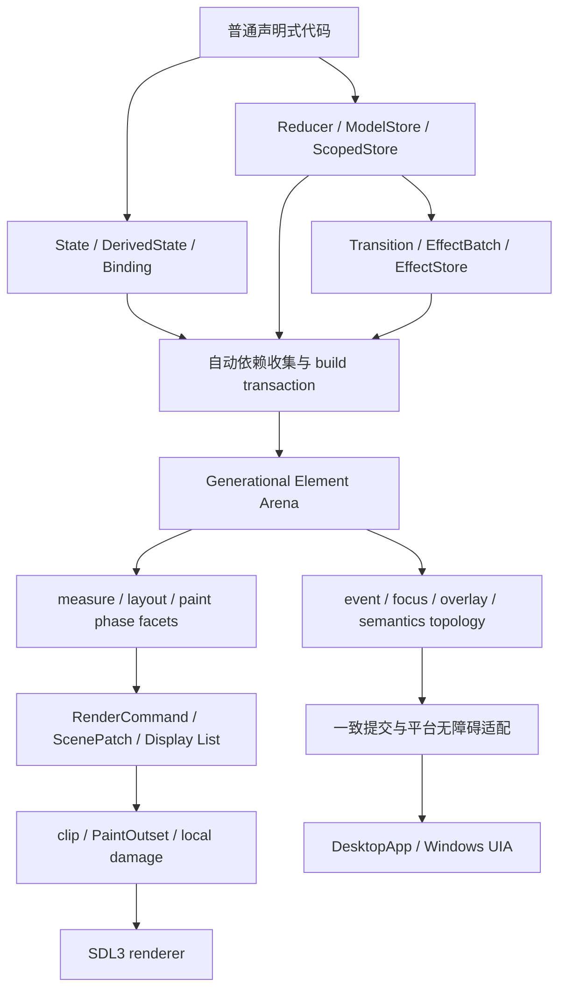

# 下一代 GUI 框架重构总结

## 结论

本轮迭代已经在约定的 Windows 验收范围内完成。CUI 从“声明式外观、内部仍混有手工 retained/revision 与多套
提交路径”的框架，收敛为一个以自动增量 Element 内核为中心、状态与效果分层、事件/焦点/浮层/语义共享一致
提交边界的 GUI 系统。普通开发者只需读写 `State` 或使用 `Binding`；大型特征可以逐级升级到
`Reducer`/`ModelStore`、`ScopedStore` 和 `EffectStore`，不需要为了性能切换另一套 UI 编程模型。

这不是只完成 API 包装：身份、依赖、布局、绘制、事件、语义、生命周期、桌面运行时、性能测量与发布包都经过
了相应的内核重构和直接验证。最终 Windows 证据为 GUI 六包 853/853、生产行覆盖 79.58%、48/48 示例、24/24
真实窗口冒烟、20/20 桌面生命周期、125 项五样本性能基线和独立复现 0 回归。Linux/macOS 实机验证按本轮约定
延期，因此本文不把 Windows 结论外推成其它平台已经通过。

## 从什么问题出发

初始架构最主要的张力不是“少几个控件”，而是以下问题互相放大：

- 声明式 builder、手工 retained subtree、revision、damage 和平台提交之间存在多条事实路径，开发者容易同时思考
  业务状态、缓存身份与失效协议。
- 状态可用，但派生、事务、深层字段绑定和大型特征组合没有统一代数；局部 convenience 与全局可推理性之间存在
  断层。
- build、measure、layout、paint、event、focus、overlay、semantics 各自维护缓存或注册表，失败时很难保证它们
  同属最后一次成功帧。
- 惰性列表、文本、长文、密集表单和大规模焦点/浮层的复杂度边界不明确，很多优化依赖调用者知道隐藏开关。
- 性能基准能运行，但一度会受到旧构建产物、coverage profile、移动 P/E 核、GPU 热状态和固定 A/B 顺序影响。

重构因此采用三条硬约束：单一事实源、失败原子提交、用实测决定复杂性。无法通过确定性契约或 A/B 证明收益的
优化不会进入生产默认路径。

## 最终架构

### 1. 自动增量 Element 内核

`AutomaticRenderNode` 与 generational Element arena 现在负责声明身份、位置槽、依赖、阶段结果和最后成功提交。
build 先在 transaction arena 中构造候选树，成功后才提升；measure/layout 使用 pending/committed 双缓冲，异常不会
泄漏半帧几何。每个阶段只收集自身读取的状态，稳定读取轨迹直接作为已提交前缀证书，首个差异才退回通用集合
正规化。

结果是普通 builder 自动获得脏路径裁剪、稳定子树采用、measure/layout memo、显示列表重放和局部 damage。显式
`RetainedSubtree` 仍保留为高阶控制面，但不再是获得合理性能的必选编程范式。身份由位置槽、`Keyed`、`ForEach`
与显式 key 分层表达，开发者不用给每个普通节点制造字符串身份。

### 2. 状态、绑定与事务

`State<T>` 被重构为有序、可重入、无毛刺的事务式可观察源；事务中某个观察者失败时仍会排空其它源和派生边，再
传播首错。等价策略既能抑制单次等值写，也能抑制事务首尾等价的净零变更。`DerivedState` 是惰性的一等依赖节点，
支持单源、乘积和数组派生，并用写 epoch 作 O(1) 否定证书。

`Lens`/`Binding` 把深层字段读写变成可组合 optics，`Prism` 表达 Action 的可选分支；`Bindable.update` 将任意深度
变换归约为一次根 read-modify-write。`cui.testing` 直接执行 Lens/Prism 往返律和状态策略等价律，API 的“应该可
组合”不再只靠文档承诺。

开发者的思考复杂度因此形成渐进阶梯：局部交互用 `State`/`rememberState`；表单字段用 `Binding`；大型业务用
`ModelStore`；只有存在外部效果时才升级 `EffectStore`。每一层复用下层的同一状态和增量内核，没有第二套视图
生命周期。

### 3. 单向数据流与大型模型

`Reducer<Model, Action>`、只读 `ModelStore`、`ScopedStore` 与 `FeaturePath` 建立强类型单向数据流。selector 复用
`DerivedState`，结果等价策略可阻断无关 Action 的重建传播；scope 与末端 selector 可融合为一个派生节点。

重复特征由稳定顺序的 `IdentifiedArray` 与 child-first reducer 组合，关系模型由 `EntityTable` 正规化为 ID 键控
持久表。批量 Action/实体更新在一个根快照上折叠、只提交一次，避免每一步复制整个集合或推进一次 revision。
`EffectReducer` 返回 `Transition<Model, Effect>`，不可变 `EffectBatch` 以 O(1) 拼接效果描述；解释器通过一次
`connect` 放在组合根，子视图仍只看普通 scoped store。

### 4. 惰性、布局与绘制

`LazyColumn`、`LazyRow`、`LazyList` 和统一 viewport controller 支持窗口化、估计/自测量 extent、按 index/key
滚动和可观察数据 revision。连续滚动位置只在跨越离散物化边界时重建窗口，普通帧继续复用已提交结构。

绘制侧建立值语义 `RenderCommand`、层次 `ScenePatch`、有界 display-list LRU 和持久 slot-run 空间索引。
`PaintOutset` 将阴影、焦点环、Canvas 等越界绘制域显式合成，替代所有节点固定 clip 余量；damage、Scroll、Lazy
与 Reveal 共用这一契约。高 DPI 使用基于物理 backing 与资源预算的 Auto 策略，并保留明确诊断。

GPU 第二后端没有因“更现代”而直接进入产品。SDL_GPU/D3D12 的 clear-only 和代表命令流 A/B 没有跨过收益与 P95
门槛，因此最终继续使用较简单且更稳定的 SDL renderer；这是用实验减少架构面，而不是未完成的后端工作。

### 5. 事件、焦点、浮层、语义与无障碍

事件传播统一为 Capture/Target/Bubble，处理结果是显式 `EventOutcome`；有界指针命中使用容器有序 AABB topology，
完全重叠仍保持正确层序。焦点、overlay、tooltip、portal 与 semantics 都采用 pending/committed fragment，并与
Element 布局成功提交同步提升。

语义树是视觉 Element 树的一个商映射：只保留可访问节点，同时保存父语义身份和结构 revision，因此同索引换父
也会发出结构移动。Windows UIA bridge 与应用观察器具有独立 revision cursor 和熔断边界；一个分支失败不会阻止
另一个分支收到更新。失败记录保留来源、操作、revision 和 cause，桌面层可以诊断而不会让整个 UI 上下文失效。

### 6. 桌面生命周期与交付

`DesktopApp` 的后台唤醒、跨线程 post、窗口复用、异常清理和原生资源 epoch 被纳入一致生命周期。真实窗口压力
验证连续 20 次启动/关闭以及 retained/full 像素等价。Windows 干净发布目录只带主程序、仓颉 runtime、bounds、
SDL3、SDL3_ttf 和 `cui_uia.dll` 即可运行 lifecycle、automatic partial/fallback 与 retained damage 四个场景。

收尾视觉矩阵还发现并修复了 `process_manager` fixture 首帧竞态：确定性进程数据虽然已经注入，但工作线程可能
使状态文案在“正在刷新”和“0 秒前刷新”间变化。现在 fixture 预置同一邮箱，刷新间隔按结果完成上屏的时刻计，
完整 24 项冒烟重新通过。

## 数学结构如何产生工程收益

- **积与余积**：多源 `DerivedState`、Element phase facets 是积；可选子状态与 Action `Prism` 是余积。它们让状态
  组合与失败分支显式化，减少空值和类型擦除协议。
- **范畴与 optics**：Lens/Prism 的组合就是态射组合；identity、get-put、put-get、put-put 等定律被做成可执行
  检查。深层绑定和 reducer pullback 因而可以融合，而不是堆叠闭包和中间派生节点。
- **幺半群**：Reducer、Modifier 与 `EffectBatch` 都需要结合且有单位元。平衡 concat 与 O(1) effect 拼接把大型
  组合从左结合深链中解放出来，同时保持声明顺序。
- **Writer 结构**：`Transition<Model, EffectBatch>` 将纯状态归约与效果描述配对；测试可以直接检查“新模型 +
  效果批次”，生产才解释效果，避免 reducer 内隐式 I/O。
- **固定点与事务**：声明树是递归结构的有限固定点近似；transaction arena 先构造候选，再以一次 commit 提升，
  把“部分成功的树”排除在可观察状态之外。
- **拓扑与几何代数**：事件/语义 projection 保持父子与顺序关系；`PaintOutset` 类似局部几何域的 Minkowski 扩张，
  damage 是这些域的并与裁剪；连续 scroll 到离散物化窗口的映射只在边界改变拓扑。

同调没有被强行放进运行时。它对洞、边界和全局形状的抽象很强，但当前 GUI 增量问题已经能由有序树、商映射、
局部几何域与事务提交直接表达，没有证据表明引入链复形会降低复杂度或提高性能。数学在这里是选择可执行不变量
的工具，不是命名装饰。

## 量化收益与诚实取舍

最终五样本 Windows AC 基线中的代表结果：

| 场景 | 对照 | 结果 | 含义 |
| --- | --- | --- | --- |
| 240 分支单点自动更新 | 强制全重建 | 579.04 μs vs 977.82 μs | 完整帧约减少 40.8% |
| 96 绘制节点自动显示列表 | 强制直绘 | 2.26 μs vs 18.33 μs | 稳定绘制路径约减少 87.7% |
| LazyColumn 增量物化 | 强制全量 | 211.37 μs vs 280.85 μs | 滚动帧约减少 24.7% |
| 240 selector 等价策略 | 普通 selector | 942.68 μs vs 1610.84 μs | 无关投影传播约减少 41.5% |
| 100k `scrollToIndex` | 100k `scrollToKey` 冷查询 | 173.78 μs vs 1390.80 μs | 有 index 时避免全 key 查找，比例约 0.12 |
| 自动 State 惰性数据 | 手工 snapshot+revision | 配对比 1.04 | 用约 4% 微基准成本换取消除手工版本协议 |
| 真实 96 区域 command replay | 强制全量 | 518.57 μs vs 557.87 μs | 本机收益约 7%，不夸大为数量级提升 |
| 单区域 damage | command replay | 507.08 μs vs 518.57 μs | 本机额外收益约 3%，正确性收益更主要 |

独立五样本复现中，18 个物质级 headless 案例整体 factor 为 1.04、残差噪声 ±2%，无相对回归；三个内核配对变化
为 0.96x、1.03x、0.95x。125 项活动基线全部稳定，最差物质级 MAD 5.44%，最差配对 MAD 4.38%。106/106
headless 案例达到 120fps 预算，19 个真实窗口案例 P95 全部达到 60fps，其中 18 个达到 120fps。

性能门禁本身也被重构：每个包首次运行前强制 clean，Windows 混合核心固定到最高 EfficiencyClass，显示基准先
做两轮未记录稳态预热，A/B 轮内正逆序对消，敏感场景取进程中位数，候选与活动基线采用摘要绑定的两阶段晋升。
这次收尾正是靠这些机制区分了真实内核退化、P/E 核调度和 GPU 热状态。

## 最终验证

- GUI 六包：853/853；生产源码 166 文件、14610/18359 行，覆盖率 79.58%。
- 性能：125 项五样本 Windows AC 基线，独立五样本检查通过，0 稳定回归。
- 桌面：20/20 生命周期，retained damage 与 full 像素差 0。
- 示例：48/48 包门禁；8 个代表应用的 test/snapshot/retained-diff 共 24/24。
- 发布：Windows x86_64 干净目录 6 个制品、4 个场景、原生 UIA，像素差 0。
- 质量：严格 L2 新增 error/warning 均为 0；完整外部工具的存量继续保留为可见债务，没有通过放宽基线伪装完成。

更细的实现与决策证据见[自动增量架构](automatic-incremental-architecture.md)、
[阶段三架构决策](phase3-architecture-decision.md)和[完成度审计](next-generation-completion-audit.md)。
