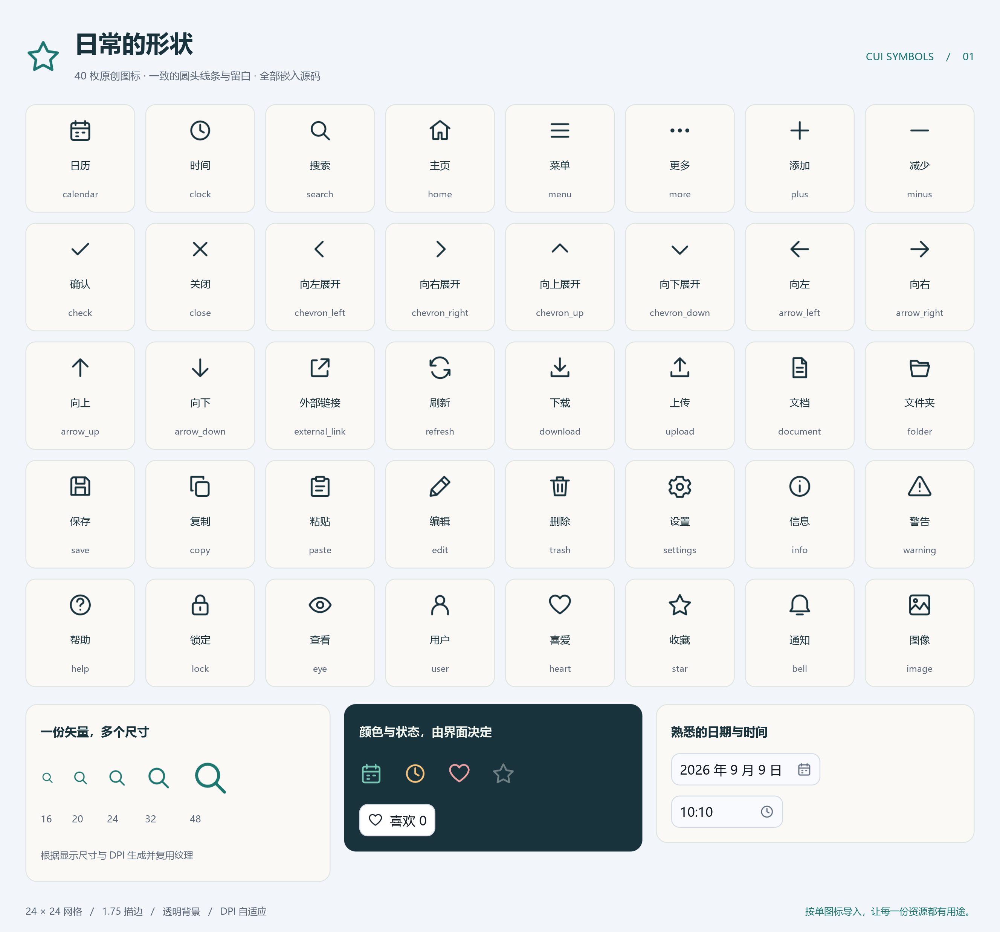

# 源码预置图标与静态链接验证

本文保留最初函数接口阶段的实现与测试记录。当前接口已统一改为 `public let ICON_*`，见[常量接口迁移报告](icon-constants-2026-09-09.md)。

日期：2026-09-09。环境：Windows x64、Cangjie 1.0.5、SDL 3.4.12、SDL3_image 3.4.6。

## 交付内容

- 40 枚原创静态线框图标，数据全部写在 `src/symbols/<name>/source.cj`，没有随 GUI 库交付的图片或字体文件。
- 单图标单子包，工厂返回稳定的 `IconSource`，默认 Template，复用已有尺寸／DPI 栅格化、着色、透明度与有界纹理缓存。
- 父包不再导出图标，也没有全量注册表、名称枚举或自动注册。原有应用文件／内存图标接口保持可用。
- DatePicker／TimePicker 恢复日历／时钟，并修正闭合字段文字与图标区域可能重叠的问题。测量实际中文日期或 12 小时制文本，预留两侧内边距、18 单位图标与 8 单位间隔；小空间下裁剪并恢复外层裁剪状态。
- 新增完整的 symbols 图鉴；icons 工坊展示预置操作图标；calendar 的月份切换按钮使用预置箭头并删除不再需要的两枚应用 SVG。
- 文档检查支持多级子包，新增单图标静态链接门禁及其失败路径测试。

用法见[预置图标指南](../../docs/guide/how-to/preset-icons.md)、[API 完整目录](../../docs/api/cui/symbols/index.md)、[示例](../../examples/symbols/README.md)。

## 静态链接的实际边界

最小工具链实验发现，同一包的不同文件、函数，以及公共再导出，都可能把未调用图形数据带入 Windows 可执行文件；仅拆文件或延迟创建不足以满足按需链接。
最终采用独立子包，默认静态链接，无需 LTO 或 whole-archive。

`python .dev/cli.py check symbol-linking` 在独立构建目录中构建、启动并检查 43 个真实程序：不导入图标、40 个分别只导入一枚的程序、全量程序，以及兼容总包程序。
使用每份真实 SVG 图形数据作为唯一指纹，检查应有资源存在、未引用资源缺席；全量案例作为正向检测对照。
所有 43 个程序均启动成功且输出完成标记，数据集合均符合预期。

| 案例 | 实际包含的预置图形 | EXE 字节数 |
|---|---|---:|
| 精确导入 media，无预置图标 | 无 | 8,701,952 |
| 仅导入 clock | clock | 8,708,608 |
| 导入全部 40 枚 | 全部 40 枚 | 8,883,712 |
| 使用兼容的 `cui.*` | calendar、clock | 10,807,808 |

数字包含对应 GUI／标准库依赖，不包含外部 SDL DLL，受编译器和节对齐影响，不能解释为 SVG 自身大小。
40 个单图标程序逐个排除了其余 39 枚数据。日期与时间组件所在的 `cui.controls` 会间接引用 calendar／clock；`cui.*` 保持兼容，也会引入这两枚。
需要完全没有预置图标的程序，应使用不经过 controls 的精确导入链。没有承诺对聚合包内部所有未调用控件进行跨包消除。
其他平台、编译器或动态库／whole-archive 策略必须重新验证，不能直接套用本机结论。

证据：`target/dev/symbol-linking/report.json`，包含编译器版本、每个编译命令、包含集合、EXE 大小、SHA-256 与运行结果。

## 验证结果

| 验证 | 结果 |
|---|---|
| 修改前构建及库测试 | 构建成功，988/988 |
| 最终完整构建及库测试 | 构建成功，994/994；完整门禁后再次使用同一测试产物运行也通过 |
| 新增图标测试 | 40 枚 × 6 个尺寸（16／20／24／32／48／96），另覆盖 Original 解码 |
| 资源身份与缓存 | 多次获取同一工厂不增加解码次数；单资源失效不驱逐其他图标 |
| 真实像素 | 40 枚均有可见图形、正确着色，图形不越出指定边界 |
| 日期／时间回归 | 重建复用两份资源、窄控件裁剪恢复、大字号及 12 小时制实际文本测量 |
| 静态链接与程序启动 | 43/43 |
| 开发工具自测 | 102/102 |
| symbols／icons／calendar | 三个示例测试、截图、增量／完整绘制对照均通过；图鉴调整后另做串行复验 |
| booking／scheduler | 另对两个使用日期时间组件的既有示例复验，6/6 与 5/5 测试通过，实际截图与完整绘制对照通过 |
| 增量／完整渲染 | 共五组零容差逐像素一致；最终图鉴再次零容差通过 |
| 文档示例 | 144 个完整程序编译通过 |
| L2 内置质量门禁 | 0 ERROR、0 WARN，和修改前基线相比没有新增结果 |

完整门禁、日志和测试报告位于 `target/dev/preset-icons/`。最后库测试明细为 `delivery-tests.log`；完整构建／测试门禁为 `full-delivery.json`；示例最终复验为 `symbols-delivery-report.json`。
booking／scheduler 复用了同一发布静态库，用 `cjc --test` 运行各自测试，再编译应用并启动两种渲染模式；完整命令和日志在 `related-examples/`。五个示例的画廊截图均已更新。

## 审查与测试边界

预置资源是私有不可变包级描述，不共享 GPU 对象；调用工厂不复制 SVG，也不引入逐帧解码。缓存、采样与颜色应用继续使用现有实现。
这次验证了缓存行为，没有据此宣称 FPS 提升或对所有 GPU 做性能保证。

全仓外部 cjfmt／cjlint 报告仍有 2100 条建议，与内置门禁分开统计。涉及新增资源的建议已审查：

- `SOURCE` 的命名沿用本库不可变全局常量风格；包级作用域用于保存稳定资源身份。把初始化移入工厂会重复复制字节并破坏缓存复用，因此保留私有包级定义。
- SVG 的 `http://www.w3.org/2000/svg` 是固定命名空间标识，不是网络端点，不会发起请求。内置检查仅在具体字符串行上注明准确的 `public-endpoint` 豁免理由；未修改检查器或关闭项目规则。外部同类建议保留并在此说明。
- 新测试保留仓库现有的紧凑断言风格，未批量格式化测试或无关源文件。修改的生产代码已执行项目 cjfmt。
- 既有 `signature-drift` 项目级配置保持不变，无新增未接受的覆盖缺口。

开发中遇到并已处理的中间失败：旧 cjpm 依赖缓存未识别新子包，刷新生成的依赖元数据后重建成功；一次链接冒烟与普通测试共享构建目录导致读到正在替换的归档，门禁已改用独立目录并完整复验；一次测试报告读写冲突仅影响报告落盘，最终串行复验成功。首次像素测试漏设预期图标尺寸、示例修饰器顺序及旧包清单断言也由测试发现并修正，未降低断言标准。

截图为实际 SDL 窗口输出。未引入动画，未拷贝 WebP／TIFF／AVIF 可选 DLL。所有图案为项目原创，遵循仓库 MIT 许可证。
