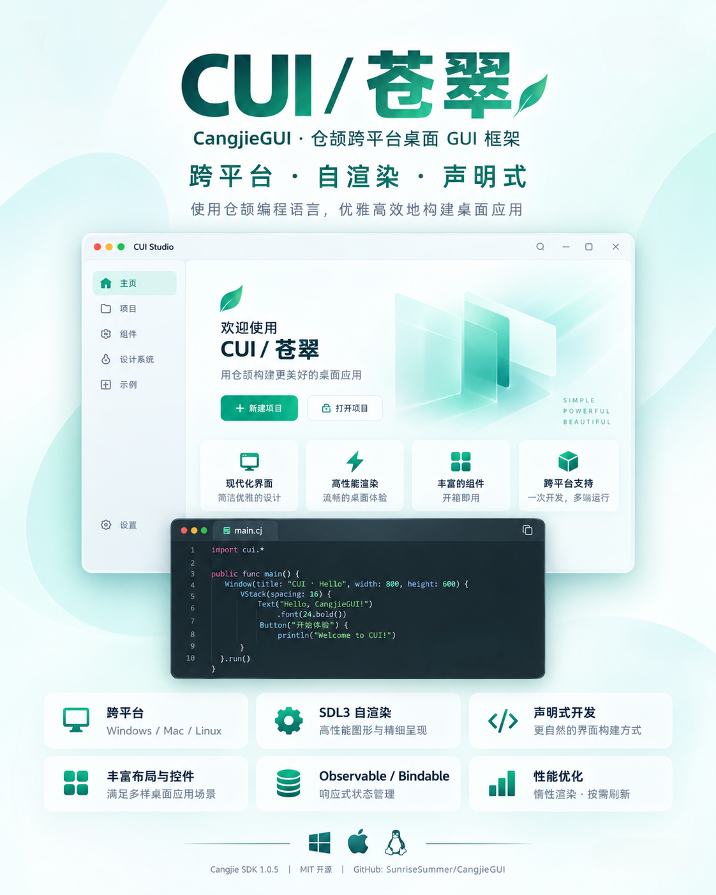

# CUI／苍翠：仓颉桌面 GUI 框架

用[仓颉编程语言](https://cangjie-lang.cn/)实现的跨平台/自渲染/声明式桌面 GUI 框架，提供声明式界面构建、状态管理、常用组件、图形图像渲染以及系统能力集成等。底层依赖[仓颉 SDL 图形库](https://github.com/SunriseSummer/CangjieSDL)。


## 文档与示例

- [使用指南](docs/guide/index.md)：按概念、任务和完整教程学习。
- [API参考](docs/api/index.md)：查询签名、默认值与行为边界。
- [示例应用](examples/README.md)：运行完整工程并完成配套练习。

## 开发环境

- Cangjie SDK 1.0.5
- Windows/Mac/Linux
- 参阅 [`CangjieSDL`](https://github.com/SunriseSummer/CangjieSDL) 项目文档，根据目标平台规格配置 SDL 相关动态库

> [!IMPORTANT]
>
> 发布和部署基于 CUI 的桌面软件时，请确保 SDL/SDL_ttf/SDL_image 动态库位于仓颉可执行文件目录，或在目标平台的动态库搜索路径中，即可以作为私有资产打包或在目标平台作为公共运行时安装。

## 快速开始

新建仓颉项目，在 `cjpm.toml` 配置 CUI 依赖：

```toml
[dependencies]
cui = { path = "<path/to/CangjieGUI>" }
```

在 `src/main.cj` 中编写代码创建一个简单窗口：

```cangjie
import cui.*

main() {
    let message = State<String>("你好，CUI")
    let app = DesktopApp(WindowSpec("CUI 示例", 640, 420))

    app.run {
        VStack {
            Panel {
                Label(message.value)
            }.flexible(false)
            Button("更新文本", {=> message.value = "状态已更新"})
                .role(ButtonRole.Primary)
                .width(160.vp)
        }.spacing(12.vp).padding(20.vp)
    }
}
```

执行 `cjpm run` 即可运行查看效果。

