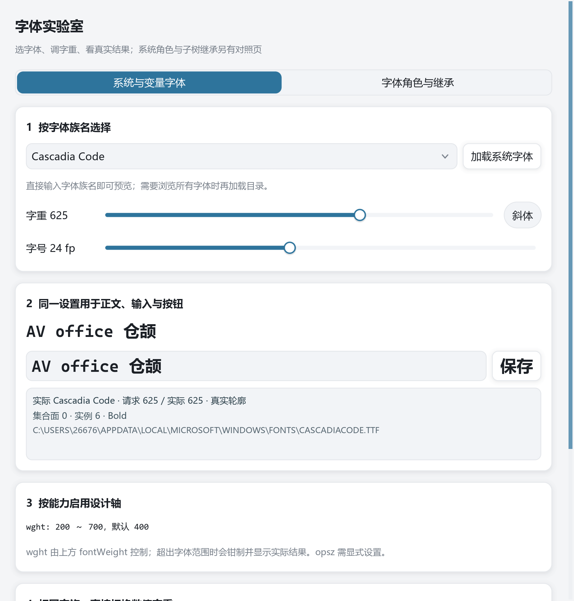

# fonts：字体实验室

按字体族名选字体、拖动数值字重、切换斜体，实时比较 Label、TextField 和 Button 的效果；同时显示**请求字重、实际字体面、实际字重与合成状态**。第二页比较应用默认、衬线和等宽角色。无需下载字体即可运行；检测到 Cascadia Code 时默认演示 625 字重。



## 建议体验顺序

1. 可以直接输入族名预览；需要浏览全部字体时点击“加载系统字体”，再点击选择器箭头。当前值自动高亮；展开后直接输入会替换所选文字并过滤。切换斜体，拖动字重和字号，编辑样张。观察正文、输入框与按钮共享 TextStyle。
2. 若安装 Cascadia Code，比较 200 / 350 / 400 / 600 / 625 / 700。官方 SDL_ttf 配合仓颉虚拟实例使用真实变量轮廓；625 连续插值。未安装时选本机其它变量字体。
3. 选择带 `wdth` 或 `opsz` 的字体，启用设计轴并拖动滑块。控件按 `Fonts.familyFaces(name)` 定向读取的轴出现；仅有 `wght` 的字体不显示额外轴开关。
4. 输入一个不存在的字体名，查看上方的实际解析与回退诊断。把请求字重拉出字体的轴范围，观察钳制后的实际字重。
5. 切换“字体角色与继承”：比较 Serif / Mono / 应用默认，再给同一输入区叠加粗体、斜体。窄窗口下文本应换行或省略，不靠增加字距修补斜体。

内容较长时向下滚动可见全部轴和字重对照。界面的路径表示主字体的实际文件；中文若缺字，可由后备字体补齐，不能据主字体名称判断每个字符都来自该字体。

## 常用写法

```cangjie
// 启动阶段设置一次；默认选平台 UI 字体，不硬编码 Windows 路径。
Fonts.setDefault(FontRole.systemUI)
Label("AV office").fontFamily("Cascadia Code").fontWeight(FontWeight(625)).italic()

// 统一设置整棵子树，避免逐个控件配置。
VStack {
    Label("预览")
    TextField(text)
    Button("保存", {=> ()})
}.textStyle(TextStyle(fontFamily: FontRole.monospace, fontSize: 20.fp,
    fontWeight: FontWeight.semiBold, italic: true))
```

系统族名可以直接用于 `fontFamily`；需要稳定的应用别名时使用 `Fonts.registerSystem("Code", "Cascadia Code")` 并检查返回值。程序的视觉一致性必须依赖特定字体时，采用 [wenkai 的随附文件方案](../wenkai/README.md)。

```cangjie
// 只查询所选字体，无需枚举完整系统目录。
let selected = Fonts.familyFaces("Cascadia Code")

// 在字体选择器的加载／刷新动作中查询完整目录，避免阻塞普通应用启动。
let names = Fonts.systemFamilyNames()
let faces = Fonts.systemFonts()
Fonts.refreshSystemFonts(force: true) // 安装新字体后由显式动作触发

// 只有目标字体确实声明此轴和范围时才传入。
let axes = FontVariations([FontVariation("wdth", 90.0)])
Label("Width").fontFamily("My Variable Font").fontWeight(FontWeight(625)).fontVariations(axes)
```

高层 `fontWeight` 范围为 1～1000，本例滑块取常用的 100～900、步长 25，减少拖动时反复创建字形；API 仍接受精确字重。静态字体按匹配规则选择可用面；连续插值只适用于有 `wght` 轴的变量字体。`.bold()` 等价 700。显式未知轴、重复轴或越界坐标会报错；`fontWeight` 超出字体范围则钳制并报告实际值。`opsz` 不随字号自动调整。

`Fonts.supportsVariations()` 检查官方 SDL_ttf 3.2+ 的支持版本。部署使用官方运行库，字体元数据、匹配和变量实例由仓颉实现；不会按字重复制整份字库。Windows 提供实际运行验证；Linux/macOS 的新代码已做宿主侧类型检查，仍需各自构建与实机验收。系统服务只桥接可访问的文件字体，私有内存／远程字体可能无法使用。

可选持久缓存由应用在启动时配置：先通过 `ApplicationPaths.preferencePath("Example", "FontLab")` 准备可写用户目录，再调用 `Fonts.setMetadataCache(dir + "font-metadata.tsv")`。默认不开启；不建议写入系统字体目录或只读的安装目录。目录解析失败应允许无缓存启动。

## 代码导航

预览中的内容型 VStack 和输入 HStack 使用 `.hug()`，按实际文字确定高度；不要给这类随字号变化的内容与固定诊断画布均分剩余高度。按钮按字形边界居中，编辑行按共同基线排版，诊断区保留独立内边距。

| 文件 | 内容 |
| --- | --- |
| [main.cj](src/main.cj) | 应用默认、演示预设与窗口入口 |
| [model.cj](src/model.cj) | 按需定向解析、显式目录加载、轴能力缓存及范围处理 |
| [lab.cj](src/lab.cj) | 族名选择、共享预览、解析诊断、变量轴与字重对照 |
| [views.cj](src/views.cj) | 页面切换、平台角色与子树继承 |
| [data.cj](src/data.cj) | 与平台路径无关的角色表 |

## 运行与回归

```powershell
cd examples/fonts
cjpm run
cjpm test --no-progress
cjpm run --run-args "--demo italic --snapshot fonts-italic.bmp"
cjpm run --run-args "--demo roles --snapshot fonts-roles.bmp"
cjpm run --run-args "--demo width --snapshot fonts-width.bmp"
cjpm run --run-args "--demo optical --snapshot fonts-optical.bmp"
cjpm run --run-args "--demo large --snapshot fonts-large.bmp"
```

`width` / `optical` 预设按能力选择本机字体；没有符合条件的字体时保留默认演示。快照是本机字体与 DPI 下的真实画面，不是跨机器像素一致的承诺。

完整契约见 [字体指南](../../docs/guide/how-to/fonts-and-typography.md)。


性能建议：普通应用直接使用字体族名／角色，只有字体选择器需要浏览完整目录时才调用 `Fonts.systemFamilyNames()`。示例字号与字轴滑杆使用明确步长，避免为每个微小位置创建新字体配置；公开 `FontWeight`／`FontVariations` 仍支持精确请求，渲染器会给出实际结果。

## 练习与验收

请求一个非标准字重，对比请求值、实际字体面与合成状态。

[返回示例学习路线](../README.md) · [运行准备](../README.md#运行准备) · [API 参考](../../docs/api/index.md)
