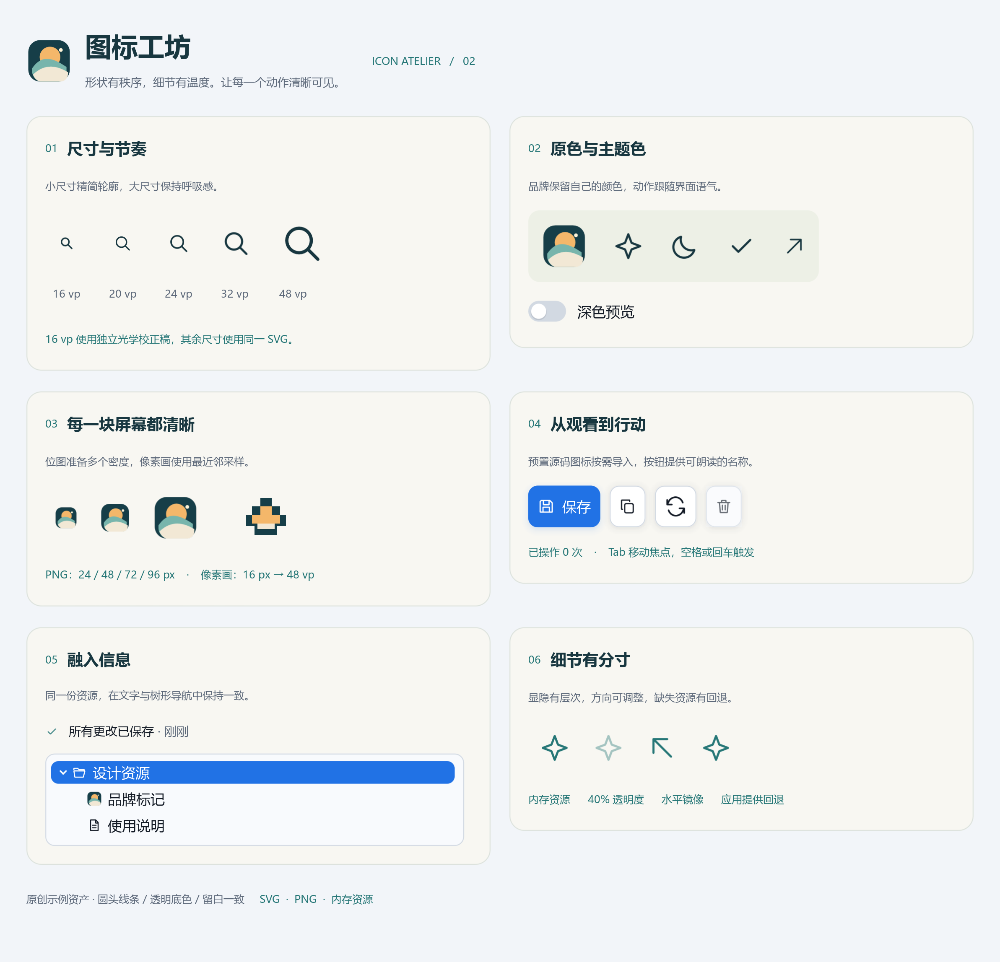

# 图标工坊

图标设计实验室，组合应用自带资源与按需导入的预置图标，展示光学校正 SVG、原色／模板、透明度、镜像、多分辨率 PNG、像素画、按钮无障碍、树节点、富文本和故障回退。

```text
cd examples/icons
cjpm run
```



线条与彩色标记按仓库 [MIT License](../../LICENSE) 提供，没有第三方图标依赖。应用文件资产与框架预置图标分开维护：生成器 [generate_assets.py](generate_assets.py) 保存本示例文件资产的可审查矢量源，SVG 和 PNG 已提交，正常运行不需要 Python；预置资源则直接保存在框架的 `src/symbols` 源码中。

```text
python examples/icons/generate_assets.py
python examples/icons/generate_assets.py --rasters ../CangjieSDL/.sdl3
```

从仓库根运行以上生成命令。第二条使用本地 SDL3_image 栅格化 PNG，不需要窗口或可选解码 DLL。应用文件资产保存在各示例目录中；预置图标无需复制 assets。

| 规格 | 展示 |
|---|---|
| 16 vp | search-16.svg 独立精简轮廓，1.5 单位笔画 |
| 20／24／32／48 vp | 24 单位 SVG，1.7 单位圆头笔画，自适应实际栅格密度 |
| 24／48／72／96／144／192 px | Original 彩色 PNG 规格表，覆盖 48 vp 的高密度使用，选择最小足够项 |
| 16 px → 48 vp | 像素画使用 Nearest，避免平滑过滤 |
| 文字行与树节点 | 复用 IconSource，保留文本基线和选择颜色语义 |

深色预览改变模板前景和容器背景，品牌图标保持原色。按钮支持 Tab／Enter／Space；保存、复制与刷新更新操作计数，删除用于展示禁用状态。最后一个图标故意指定不存在的主资源，再使用模型持有的内存图标回退；该项有且只有一个预期加载失败。

窗口可滚动，以适配较小工作区。图标视觉尺寸与按钮点击区域独立；纯图标按钮都提供可访问名称。详见[图标指南](../../docs/guide/how-to/icons.md)。

工具栏示范同时使用单独导入的 save／copy／refresh／trash 预置源码图标。完整预置图鉴见 [symbols](../symbols/README.md)。

## 练习与验收

替换一个模板资源，确认前景色生效且纯图标按钮仍有可访问名称。

[返回示例学习路线](../README.md) · [运行准备](../README.md#运行准备) · [API 参考](../../docs/api/index.md)
