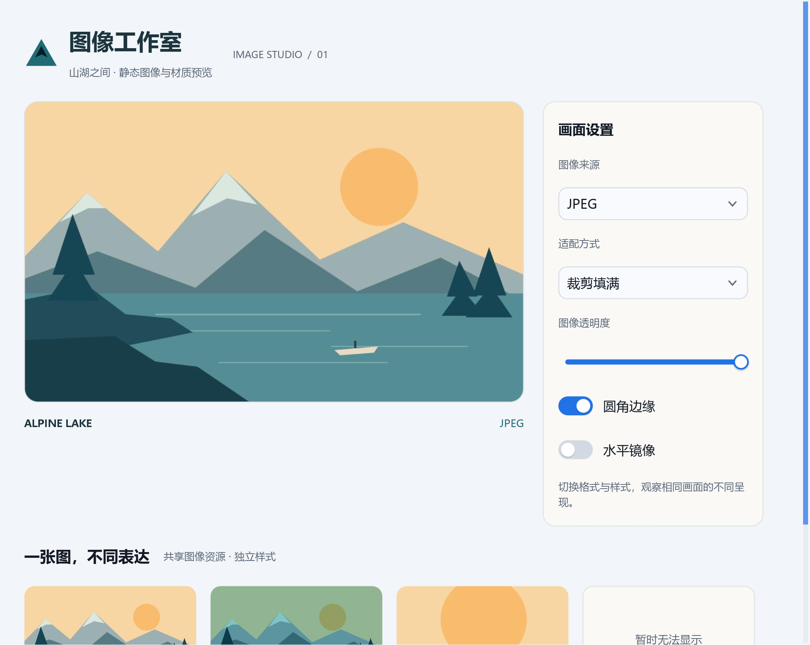

# 图像工作室



使用原创山湖插画展示静态图像组件。左侧预览，右侧设置来源格式、适配方式、透明度、圆角与镜像；下方对比裁剪、着色、局部取景和自定义失败占位。

```powershell
cd examples/images
cjpm run
```

工作目录必须是本示例目录，使 assets 相对路径有效。需要在 CangjieSDL/.sdl3 中放置 SDL3、SDL3_ttf、SDL3_image 3.4.6 运行库并设置加载路径。此示例不需要 optional 目录中的 WebP/TIFF/AVIF 库，也不播放 GIF 动画。

核心接口包括 ImageSource.memory、ImageView.size、decodeSize、fit、imageAlignment、sourceRect、cornerRadius、imageOpacity、tint、flip、imageBackground、imageBorder、errorPlaceholder 和 alt。内存来源保存在模型中，避免重建时重复复制数据。

assets/alpine.svg 与 mark.svg 为示例原创矢量图；其他格式由 alpine.svg 栅格化后编码得到，可随示例使用。失败卡片引用故意不存在的文件。自动测试覆盖全部来源/适配组合、图片描述、失败后刷新，以及分数 DPI 下完整绘制与保留绘制的逐像素一致性。

参见[图像使用指南](../../docs/guide/how-to/images.md)。


## 练习与验收

比较 Contain、Cover 与 Original，说明布局尺寸和解码尺寸的区别。

[返回示例学习路线](../README.md) · [运行准备](../README.md#运行准备) · [API 参考](../../docs/api/index.md)
