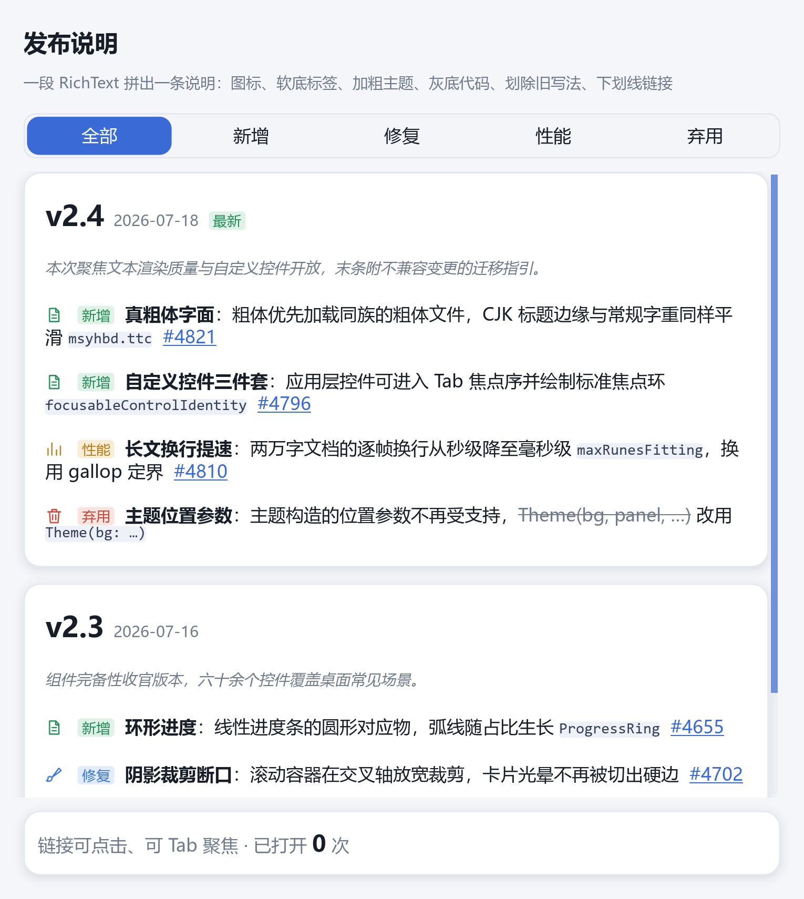

# richtext：发布说明（RichSpan 全能力合集）

一页产品发布说明，把 `RichText`/`RichSpan` 的完整词汇拼进真实排版：版本标题行三种字号混排
（大号加粗版本号 + 小号日期 + 「最新」软底标签）、斜体导语、逐条说明（类别图标 + 软底类别
标签 + 加粗主题词 + 常规描述 + 灰底内联代码 + 划除的弃用旧写法 + 下划线议题链接），底部
状态条实时反馈链接点击。类别过滤沿用分段控件。

## 演示要点

- 逐段字号：`RichSpan.fontSize` 让版本号（24）、正文（15）、标签（12）同行混排，按字体基线对齐、
  行高随最大字号增长
- 软底标签与内联代码：`highlight(color)` 画紧贴字形的圆角底盒——类别标签用类别柔和色、
  代码片段用灰底墨字（等价 `<code>` 的视觉）
- 弃用迁移的惯用排版：`strikethrough()` 划除旧写法 + 「改用」+ 代码片段
- 可交互链接：`onTap` 议题号（链接色 + 下划线），点击计数并在状态条回显；链接可 Tab 聚焦、
  Enter/空格激活（框架内建）
- 断行质量：CJK 逐字符填行；拉丁标识符整词保持不切半（`focusableControlIdentity`、`#4821`
  从行中放不下时整词移到下一行），断点空格不带进续行——这三条断行规则由渲染无关的布局引擎
  单测钉死
- 片段拼装 `noteSpans` 是纯函数：按数据可选字段决定拼哪些片段，单测直接断言片段数

## 文件结构

| 文件 | 职责 |
|---|---|
| [main.cj](src/main.cj) | 入口 |
| [data.cj](src/data.cj) | 版本区块与说明条目数据、类别名称/颜色/图标映射（纯函数） |
| [model.cj](src/model.cj) | 过滤状态、可见条目派生、链接打开计数 |
| [views.cj](src/views.cj) | 版本卡、`versionSpans`/`noteSpans`/`statusSpans` 片段拼装 |
| [theme.cj](src/theme.cj) | 纸白编辑排版主题、代码片段与链接用色 |

## 关键实现

### 一条说明 = 一段 RichText

```cangjie
RichText([
    RichSpan.icon(categoryIcon(c), color: categoryColor(c)),
    RichSpan.text(" 新增 ", color: categoryColor(c)).highlight(categorySoft(c)).fontSize(12.0),
    RichSpan.text("真粗体字面").fontWeight(FontWeight.semiBold),
    RichSpan.text("：粗体优先加载同族的粗体文件…"),
    RichSpan.text("msyhbd.ttc", color: CODE_INK).fontFamily(FontRole.monospace).highlight(CODE_BG).fontSize(13.0),
    RichSpan.text("#4821", color: LINK_COLOR).underline().onTap({=> model.openIssue("#4821")})
])
```

长句在卡宽内自动换行，全部片段同处一个文流；代码片段的高亮盒不含内衬空格，行尾断开时
不会留下孤悬的空格高亮条。

## 字体与样式的最佳实践

根容器使用 `TextStyle(fontFamily: FontRole.systemUI, fontSize: 15.fp)`；普通片段继承正文，主题词只改 `fontWeight`，内联代码只改为等宽角色。独立设置保留其它继承字段；只有明确重置整组样式时才用 `fontStyle(FontStyle.regular)`。

```cangjie
RichText([
    RichSpan.text("正文 "),
    RichSpan.text("重点 ").fontWeight(FontWeight.semiBold),
    RichSpan.text("let value = 42").fontFamily(FontRole.monospace),
    RichSpan.text(" 斜体").italic()
]).textStyle(TextStyle(fontFamily: FontRole.systemUI, fontSize: 15.fp))
```

请缩窄窗口观察基线、换行和高亮边界；点击链接验证文字几何与命中保持一致。不同字体的缺字仍可能使用后备字体。当前会合并相邻同视觉样式的普通片段，但跨颜色／链接／高亮的统一 shaping 与完整段落 bidi 仍待扩展，不应把任意拆分片段视为复杂脚本排版的等价写法。



族名、文件注册、变量轴与平台限制见 [字体指南](../../docs/guide/how-to/fonts-and-typography.md)，交互实验见 [fonts](../fonts/README.md)。

## 运行

```powershell
cd examples/richtext
cjpm run
```

切换顶部类别过滤查看子集；点击蓝色议题号（或 Tab 聚焦后 Enter）观察底部计数变化。
支持视觉回归快照：

```powershell
cjpm run --run-args "--snapshot richtext.bmp"
```

## 练习与验收

缩窄窗口并切换类别，检查不同字号基线及换行后链接命中。

[返回示例学习路线](../README.md) · [运行准备](../README.md#运行准备) · [API 参考](../../docs/api/index.md)
