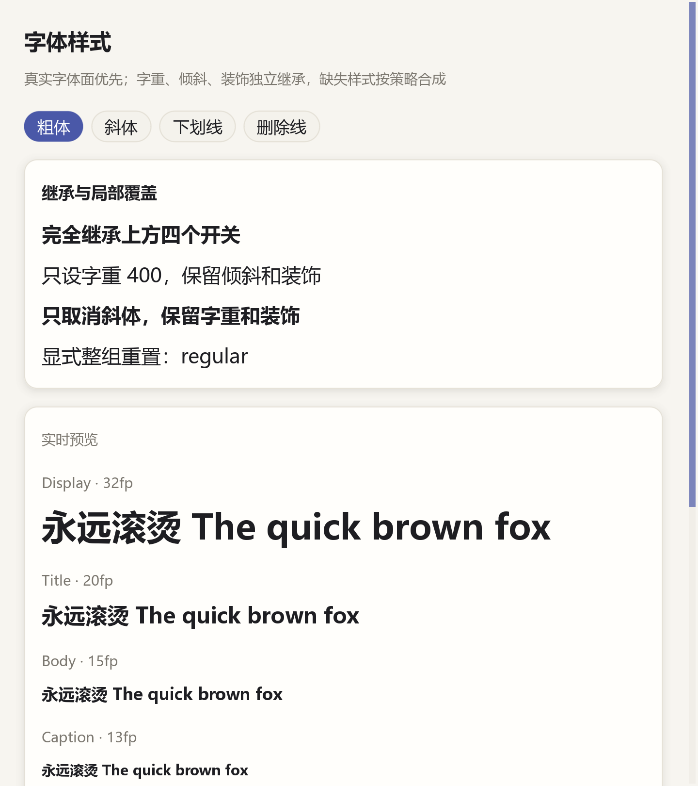

# typography：字体样式与继承

用四个开关观察粗体、斜体、下划线和删除线，并用字号阶梯和静态参考卡比较效果。继承对照卡说明**单字段覆盖与整组替换**的区别；真实粗体／斜体字体面优先，缺少时按策略合成。



## 最常用的样式写法

```cangjie
Label("标题").fontWeight(FontWeight.semiBold).fontSize(26.fp)
Label("强调").bold().italic() // bold 是 700 的快捷方式
Label("链接").underline()
Label("弃用内容").strikethrough()
```

独立修饰器只覆盖自己的字段；局部字体族或字号也不会清除其它继承样式：

```cangjie
VStack {
    Label("继承 600、斜体和下划线")
    Label("只改为 400").fontWeight(FontWeight.normal)
    Label("只取消斜体").italic(value: false)
    Label("重置字重、倾斜、装饰和轴").fontStyle(FontStyle.regular)
}.textStyle(TextStyle(fontWeight: FontWeight.semiBold, italic: true, underline: true))
```

同一个 `TextStyle` 同时指定 `fontStyle` 和独立字段时，先应用整组 `fontStyle`，再应用独立字段。本例通过模型的四个 `State<Bool>` 构建完整 FontStyle，适合编辑器工具栏这样的“明确指定整组状态”场景。

## 观察重点

- 打开全部开关：继承卡的第二行仍有倾斜／装饰，第三行仍有粗体／装饰，第四行恢复常规。
- 比较 Latin 与 CJK、小字号与大字号；真实斜体由字体设计决定，合成斜体是倾斜后备，不代表每个字体都带专门的 Italic 面。
- 缩窄窗口并滚动：内容按实绘样式测量，省略号只在空间不足时出现。框架已修正斜体栅格拉伸与字间重叠，应用不应手工加字距补偿。
- 需要指定 350、625 或检查实际文件时，使用 [fonts 字体实验室](../fonts/README.md)。

字号优先用 `fp`，由 `DesktopApp(..., fontScale: 1.25)` 统一放大文字；`vp` 用于间距，`px` 表示物理像素。不要手动把 DPI 再乘到字号上。低层 `ctx.text` 的 pointSize 是已经解析后的逻辑像素。

## 代码与运行

[data.cj](src/data.cj) 定义字号阶梯、样式表与纯函数；[model.cj](src/model.cj) 保存开关；[views.cj](src/views.cj) 展示继承、预览和参考卡；[main.cj](src/main.cj) 选择系统 UI 默认。

```powershell
cd examples/typography
cjpm run
cjpm test --no-progress
cjpm run --run-args "--snapshot typography.bmp"
```

更多设置与平台边界见 [字体指南](../../docs/guide/how-to/fonts-and-typography.md)。

## 练习与验收

打开全部样式开关，比较单字段覆盖与 FontStyle 整组重置。

[返回示例学习路线](../README.md) · [运行准备](../README.md#运行准备) · [API 参考](../../docs/api/index.md)
