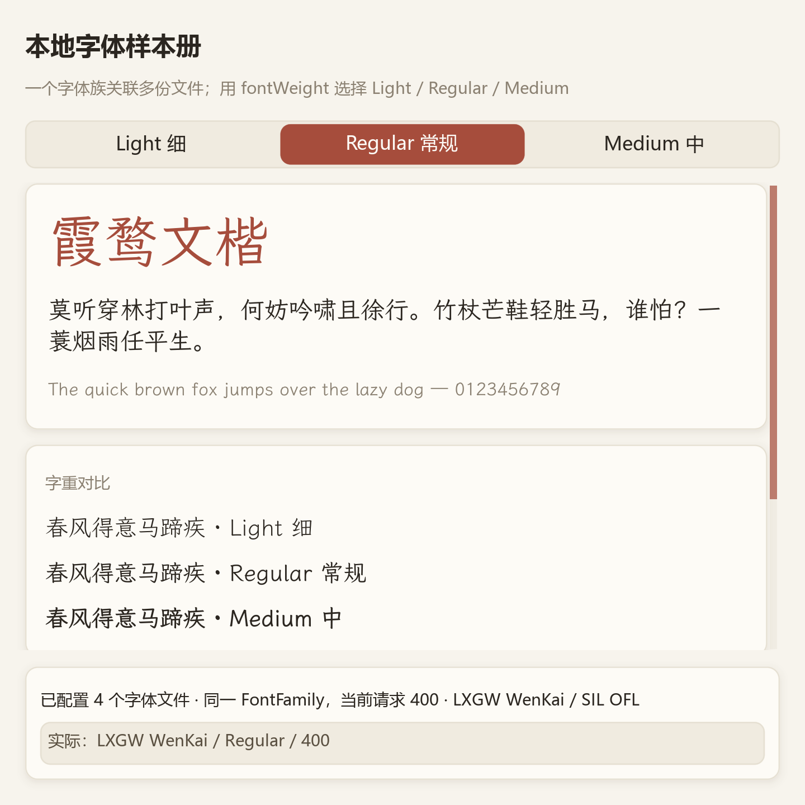

# wenkai：随附字体与静态多字重

将 Light / Regular / Medium 三份霞鹜文楷文件注册为**同一个 FontFamily**，用 `fontWeight` 切换；等宽文楷另作为代码字体族。大字样张、字重对照与实际解析状态帮助确认加载结果。



## 准备字体

准备 `LXGWWenKai-Light.ttf`、`LXGWWenKai-Regular.ttf`、`LXGWWenKai-Medium.ttf` 和可选的 `LXGWWenKaiMono-Regular.ttf`。字体文件不随本仓库分发；使用者自行取得并遵循字体附带的授权文件。

示例优先读取可执行文件旁的 `assets/fonts/`，其次读取工作目录中的 `assets/fonts/`，最后兼容本仓库 `.todo/testfonts/`。只有包含 Regular 文件的目录才被选中；空目录不会遮住后续候选。用 `cjpm run` 开发时可放到 `examples/wenkai/assets/fonts/`；发布时放到可执行文件旁，并保留字体许可证。

没有字体时仍可启动，状态栏会说明回退；Light / Medium 缺失时只登记可用面。下方“实际”显示真正打开的族名、样式名和字重，登记文件数本身不保证字体能成功解码。

## 注册一次，用字重选择

```cangjie
Fonts.registerFamily("wenkai", FontFamily(
    FontSource(dir + "/LXGWWenKai-Regular.ttf"),
    faces: [
        FontFaceDefinition(FontSource(dir + "/LXGWWenKai-Light.ttf"), weight: FontWeight.light),
        FontFaceDefinition(FontSource(dir + "/LXGWWenKai-Medium.ttf"), weight: FontWeight.medium)
    ]))

Label("春风得意马蹄疾").fontFamily("wenkai").fontWeight(FontWeight.medium)
```

以上注册片段假设三份文件均存在；[data.cj](src/data.cj) 中的 `registerWeights` 会先检查文件，省去应用逐次处理不存在字体的麻烦。切换模型字重时保持 `fontFamily("wenkai")` 不变，避免把每个字重当成无关字体名。

整块正文采用继承：

```cangjie
VStack {
    Label("霞鹜文楷").fontSize(44.fp)
    Label("正文随同一字重切换").fontSize(19.fp).wrap()
}.hug().textStyle(TextStyle(fontFamily: "wenkai", fontWeight: FontWeight.light))
```

三份文件是静态轮廓，并不会获得任意字重插值能力。请求不存在的字重时按规则选择可用面，必要时按合成策略处理，实际结果由诊断报告。需要精确粗斜体时提供相应文件与声明；只有单文件时也可用兼容的 `Fonts.register(name, path)`。

## 部署与进阶

- 使用 `ApplicationPaths.basePath()` 定位随附资源，不把开发机绝对路径复制到产品代码中。
- 注册放在启动阶段；子树用 TextStyle，局部只覆盖需要改变的字段。
- 内容卡片使用 `.hug()` 保留文字自然高度；诊断画布单独预留内边距，避免文字贴近背景边界。
- TTC/OTC 文件用 `FontSource(path, faceIndex: n)` 指定集合面。固定变量实例用独立 `instanceIndex`，编号来自该字体的枚举结果。
- 应用默认可用 `Fonts.setDefault("wenkai")`，全局缺字与保底文件用 `Fonts.setFallbacks([FontSource(...)])`。本例仅把文楷用于样张，保留系统 UI 作为操作界面的默认字体。
- 安装／替换文件后的恢复、存活测量会话及缓存生命周期见 [字体指南](../../docs/guide/how-to/fonts-and-typography.md)。

## 代码与运行

[main.cj](src/main.cj) 负责定位资源与登记；[data.cj](src/data.cj) 定义字体面和可注入的探测逻辑；[model.cj](src/model.cj) 把选中项映射为 FontWeight；[views.cj](src/views.cj) 展示共享字体族与解析状态。

```powershell
cd examples/wenkai
cjpm run
cjpm test --no-progress
cjpm run --run-args "--snapshot wenkai.bmp"
```

## 练习与验收

临时移走一份可选字重文件，确认仍能显示并报告实际选择。

[返回示例学习路线](../README.md) · [运行准备](../README.md#运行准备) · [API 参考](../../docs/api/index.md)
